# 🛠️ Documentation Technique<br>Pacman Générateur de Code JavaFrontend 

📅 Historique des mises à jour

- 19/12/2025 : Initialisation du document.
---

## 🚀 Introduction
---
Cette documentation décrit le fonctionnement du plugin Eclipse **Pacman**, nouvelle version **V5**, dont l'objectif est de générer automatiquement du code Java à partir de différentes modélisations graphiques sous ISD (Information System Designer). 

Elle apporte l'ensemble des informations nécessaires sur la modélisation et la génération d'une application de type **frontend** afin de mettre à disposition une cinématique d'écrans en langage React et permettre les appels REST vers une application de type **backend** à l'aide de librairies crées par le générateur **Pacman backend**.  

Elle est destinée aux développeurs souhaitant comprendre et utiliser l'ensemble des générateurs. 

Il est à noter que cette documentation ne rentre pas dans les détails de la modélisation de l'application, aspect dont les bases sont censées être déjà connues et maîtrisées par les developpeurs qui vont utiliser cette version du plugin  **pacman**. Se reporter aux différents documents ad hoc pour plus d'informations sur ce sujet.

❗ Les nommages des différentes classes est ici donné avec la configuration par défaut du fichier de nommage qui est généré avec un nouveau projet. Il sont donc susceptibles d'évoluer en fonction des règles précisées par les développeurs de l'application cible.

❗ De nombreux exemples de code React sont donnés dans le cadre de ce document, afin de ne pas rendre le code trop verbeux et trop long à lire, ces exemples ont pour la plupart, été expurgés de la majorité des commentaires.

## 🧩 Pacman et React

Pacman V5 frontend est un un générateur de code basé sur le framework React.

React est un framework (plus précisément une bibliothèque) JavaScript orienté vers la construction d’interfaces utilisateur modernes, dynamiques et fortement interactives, principalement pour des applications web monopages (SPA). Basé sur une approche déclarative et componentisée, React permet de structurer l’interface en composants réutilisables, chacun gérant son propre état et son cycle de vie, ce qui facilite la maintenance et l’évolution des applications complexes. 

L’utilisation conjointe de React, Vite et Faker permet de mettre en place un environnement de développement léger, rapide et efficace. React structure l’application autour de composants réutilisables et facilite la gestion de l’état et de la navigation. Vite simplifie la configuration du projet et offre un serveur de développement très rapide avec rechargement à chaud, ce qui réduit fortement le temps de compilation. Faker est utilisé pour générer des données de test, permettant de développer et tester les écrans sans dépendre d’un backend disponible. L'ensemble a été pensé afin de favoriser un développement itératif, une meilleure isolation du frontend et des cycles de test plus rapides.

Dans un contexte d’interaction avec des services REST développés en Java (par exemple avec Spring Boot), React joue le rôle de client front-end consommant des API HTTP exposées par le backend. Cette séparation claire entre le front-end React et le backend Java favorise une architecture découplée, scalable et testable, où React se concentre sur l’expérience utilisateur tandis que les services Java assurent la logique métier, la persistance des données et la sécurité.

Pour Pacman lors de l'initialisation d'un projet, le générateur va donc toujours créer uniquement deux projets distincts qui sont respectivement : 

- ***[Nom du projet]-model*** : contient les différents fichiers de modélisation de l'application ainsi que les fichiers de configuration pour les options de génération de l'application. Ce projet ne contient (et ne doit contenir) aucun code. 

- ***[Nom du projet]-server*** : le projet qui contient l'ensemble du code d'exécution pour que l'utilisateur puisse intéragir avec le code métier. Le projet serveur en React correspond à la partie front-end de l’application, chargée de fournir l’interface utilisateur et de gérer les interactions avec le backend. Il s’agit d’une application TypeScript structurée autour de composants React, exécutée côté client dans le navigateur et servie par un serveur HTTP lors du développement et du déploiement. Le projet React communique avec les services backend via des appels REST pour récupérer et envoyer des données, tout en restant totalement découplé de la logique métier, qui demeure côté serveur Java.

## 🛠️ Installation
---
### Prérequis
- Version Information System Designer  :  5.1.1+
- JDK : 17+

### Installation Node

L’installation de Node.js consiste à mettre en place l’environnement d’exécution nécessaire au fonctionnement des applications JavaScript côté serveur et des outils front-end. Elle débute par le téléchargement de la version recommandée (généralement LTS) depuis le site officiel, suivie de l’installation via un programme d’installation ou un gestionnaire de paquets selon le système d’exploitation. 

Il est à noter que, une fois installé, Node.js inclut automatiquement npm, le gestionnaire de dépendances, permettant d’installer et de gérer les bibliothèques du projet. La validation de l’installation se fera donc en vérifiant les versions de node et npm, garantissant ainsi que l’environnement est prêt à être utilisé pour le développement et l’exécution de l’application.

1 - Télécharger la dernière version Node.js sur : **https://nodejs.org**

2 - Suivre les indications du site pour l'installation. Il est possible d'installer Node.js de plusieurs manières, soit en téléchargement directement un binaire autonome, soit en passant par l'installateur *.msi* (sous windows), soit encore en passant par une image docker. 

3 - Vérifier la bonne installation de Node.js et du gestionnaire de package Npm.

```bash
C:\Users>node -v
v22.19.0
C:\Users>npm -v
10.9.3
```

### Plugins externes

1 - Vérification de la version pour l'IDE

Avant de commencer l’installation ou l’utilisation du plugin, il est indispensable de vérifier que l’IDE Eclipse utilisé correspond bien à la version 5.1.1 requise. Pour cela, ouvrez Eclipse puis accédez au menu "*Help/About Eclipse IDE*". Dans la fenêtre d’information, contrôlez attentivement le numéro de version affiché ainsi que les détails de la plateforme. Assurez-vous que la version indiquée est au moins la 5.1.1, afin de garantir la compatibilité complète du plugin et d’éviter tout comportement inattendu ou erreur d’exécution liée à une version non conforme de l’environnement Eclipse.

<div align="center">
  
</div>

2 - Installation des plugins d'édition

Si leur installation est optionnelle, les plugins d’édition JSON, YAML dans l’IDE Eclipse sont toutefois fortement recommandés pour améliorer la lisibilité, la cohérence et la fiabilité du développement. Ces plugins apportent des fonctionnalités clés telles que la coloration syntaxique, la validation de la structure, l’auto-complétion et la détection précoce des erreurs, facilitant ainsi l’édition des fichiers de configuration, des scripts de base de données et des paramètres de journalisation. 

En centralisant ces outils dans l’environnement de développement, le développeur gagne en productivité, réduit les risques d’erreurs de syntaxe ou de configuration, et assure une meilleure conformité aux standards techniques du projet.

<div align="center">
  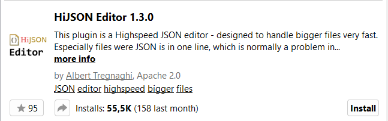
</div>
<div align="center">
  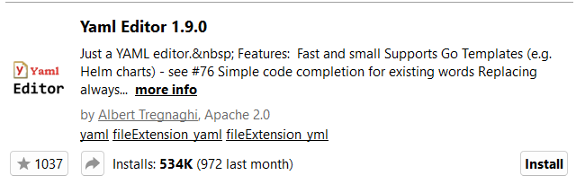
</div>

3 - Installation plugin M2E

L’installation et la configuration de Maven dans Eclipse sont essentielles pour assurer une gestion fiable et cohérente du cycle de vie des projets. Maven permet d’automatiser la gestion des dépendances, la compilation, les tests et le packaging des applications, tout en garantissant l’uniformité des versions utilisées au sein du projet. Son intégration dans l’IDE facilite l’import, la mise à jour et la maintenance des projets, réduit les erreurs liées aux dépendances manquantes ou incompatibles, et améliore la reproductibilité des builds, aussi bien en environnement de développement que d’intégration continue. 

Comme vu précédemment, si Maven est bien un gestionnaire Java, **même dans le cadre d'un projet TypeScript** de type frontend, il est nécessaire d'installer ce plugin, ne serait-ce que pour le bon fonctionnement du processus de création du projet par **Pacman**.

<div align="center">
  
</div>

### Plugin Pacman

1 - Téléchargement du plugin  

- Le plugin (sous forme de fichier au format .zip) est téléchargeable à partir de l'URI suivante : https://github.com/spi4j/pacman-front...
- Charger le plugin et le stocker dans un répertoire de votre choix sur le disque. 

1b - Compilation des sources (développement)

Il est aussi possible de récupérer l'ensemble des sources et de les compiler (JDK 17 au minimum et Maven 3.9.9) afin d'obtenir l'update site. Les étapes sont les suivantes : 

- Créer un répertoire sur le disque local
- Lancer la commande : ```git clone https://github.com/spi4j/pacman-front.git```
- Se positionner dans le répertoire ```cd pacman-front```
- Lancer la commande : ```mvn clean install -P integration```
- Récupérer le zip de l'update site dans le répertoire ***target*** du projet ***fr.pacman.front.update***

2 - Installation dans Eclipse  

- Ouvrir Information System Designer et aller dans le menu "*/Help/Install New Software...*".
- Cliquer sur le bouton "*Add*".
- Cliquer sur le bouton "*Archive*".
- Rechercher et sélectionner l'archive **Pacman** (format .zip) préalablement chargée sur le disque.

<div align="center">
  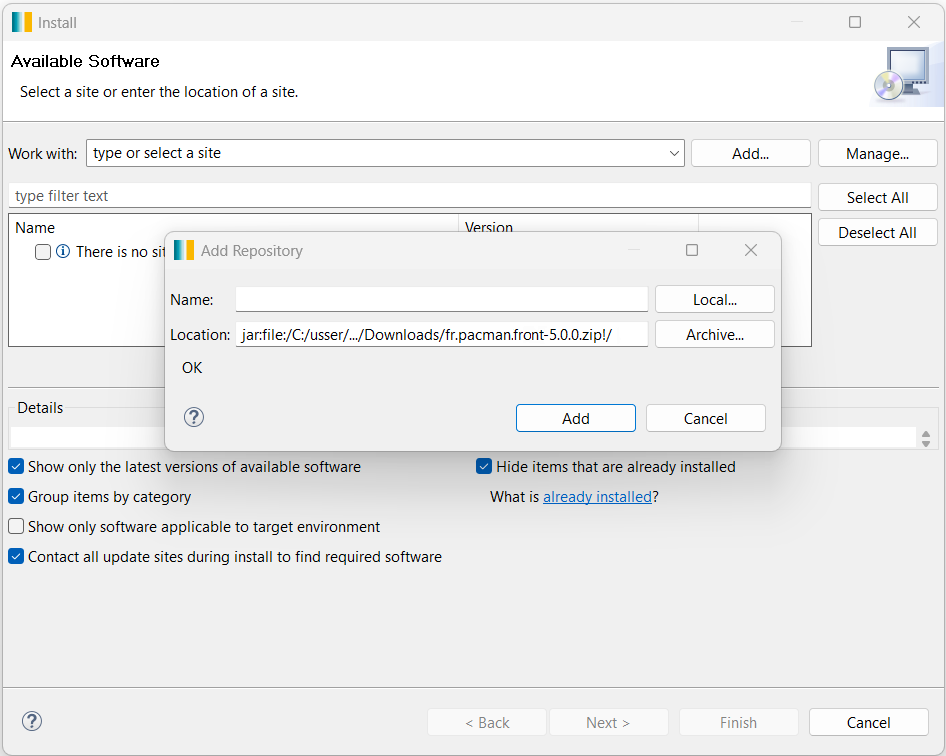
</div>

- Cliquer sur le bouton "*Add*".
- Cliquer sur le bouton "Select All".
- Décocher la case "*Contact all updates sites during install to find required software*".

<div align="center">
  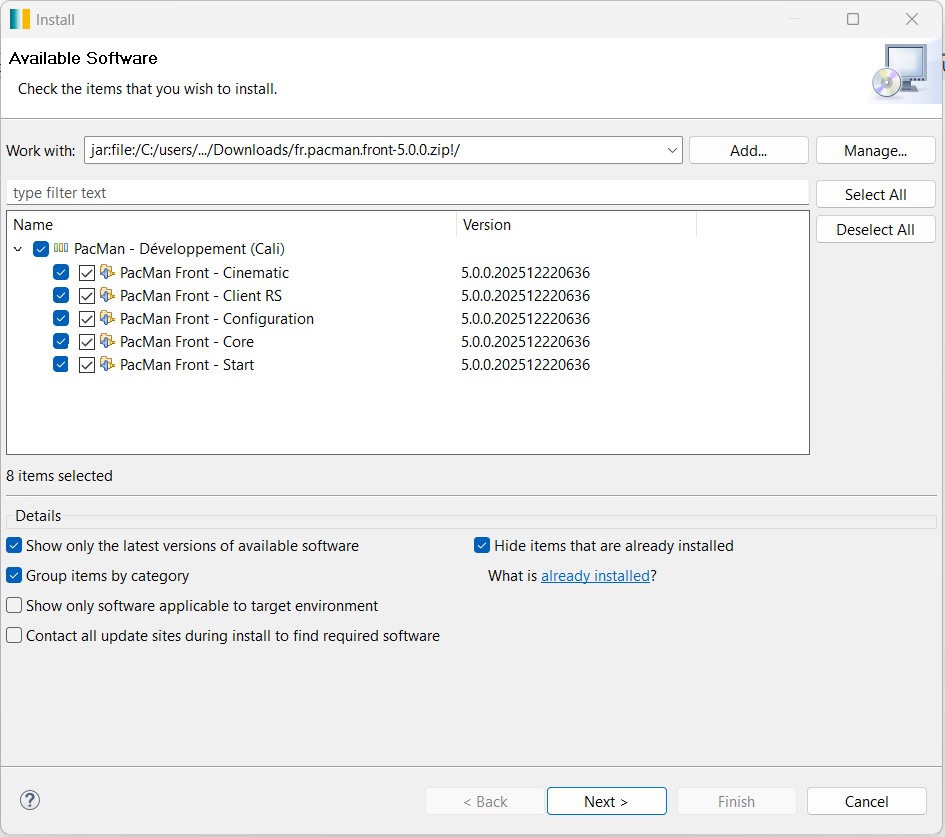
</div>

- Cliquer sur le bouton "*Next*".
- Vérifier la bonne prise en compte de l'ensemble des plugins qui vont être installés.

<div align="center">
  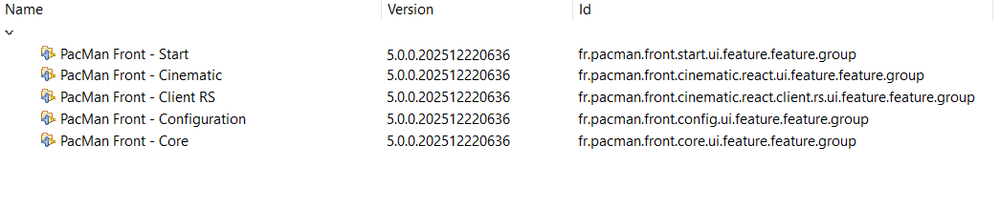
</div>

- Cliquer sur le bouton "*Finish*"
- **Pacman** n'étant pas signé, cliquer sur le bouton "Select All".

<div align="center">
  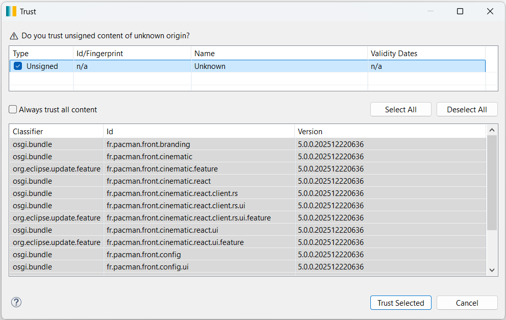
</div>

- Cliquer sur le bouton "*True Selected*".

<div align="center">
  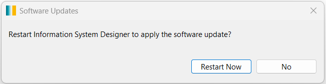
</div>

- Valider la demande de redémarrage pour ISD en cliquant sur le bouton "*Restart Now*".


3 - Vérification de l'installation  
 
- Aller dans le menu "*/Help/About Obeo Designer Entreprise Edition....*".
- Vérifier la présence de l'icône **Pacman** au niveau de la fenêtre avec la liste des plugins installés. 

<div align="center">
  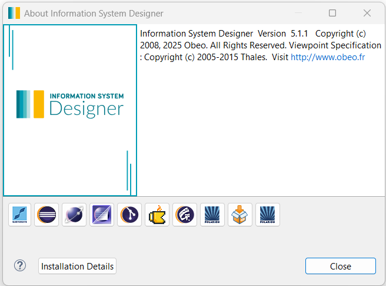
</div>

- Il est aussi possible d'aller voir plus loin en cliquant sur le bouton "*Installation Details*" et en vérifiant la liste des plugins au niveau du premier onglet "*Installed Software*".

<div align="center">
  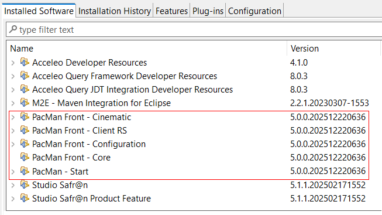
</div>

## ⚛️Création du projet  
 ---
Une fois ISD activé, se positionner sur la perspective "*Modeling*", située en haut à gauche de l'IDE.   
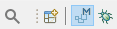

Puis, se positionner (comme tout autre création de projet) sur la vue "*Model Explorer*" et effectuer un click droit "*New/Project...*" ou se positionner dans le menu "*File/New/Project...*" en haut de l'IDE. 

<div align="center">
  
</div>

Naviguer dans l'arborescence jusqu'au répertoire "*IS Designer*" et sélectionner "*Projet Cali*". Une fenêtre de création d'un nouvel applicatif de type "Pacman" apparait alors afin de saisir les diverses informations structurantes pour la génération du projet. 

### Wizard de création

Au niveau de la création du projet frontend, simplement saisir le nom désiré pour le projet, ainsi que l'auteur ou l'organisme. Pour l'instant une seule option est disponible au niveau du choix pour le framework (et donc le language utilisé), il s'agit du framework React qui est couplé avec les composants DSFR...

❗ Les composants DSFR (Design System de l’État) du ministère constituent un ensemble cohérent de briques d’interface standardisées, conçues pour garantir l’accessibilité, la cohérence graphique et l’uniformité des services numériques publics. Ils couvrent aussi bien les éléments fondamentaux (boutons, champs de formulaire, alertes, modales, tableaux) que des composants plus structurants (en-tête, pied de page, navigation, fil d’Ariane), en s’appuyant sur des règles strictes d’ergonomie, de contrastes et de conformité au RGAA. En adoptant ces composants, les applications ministérielles assurent une expérience utilisateur homogène, inclusive et conforme aux exigences de l’État, tout en facilitant la maintenance, la réutilisabilité et l’industrialisation des interfaces.

❗ Avec les générateurs **Pacman**, c'est le DSFR React qui est utilisé plutôt que l’implémentation DSFR par défaut, ceci afin de s’intégrer pleinement à l’architecture front-end basée sur React. Cette approche permet de tirer parti de composants encapsulés, typés et réutilisables, tout en respectant strictement les principes graphiques, d’accessibilité et d’ergonomie définis par le Design System de l’État. L’utilisation de DSFR React facilite également la maintenance du code, l’homogénéité des interfaces et l’évolution de l’application, tout en garantissant la conformité aux standards numériques en vigueur (https://components.react-dsfr.codegouv.studio).


<div align="center">
  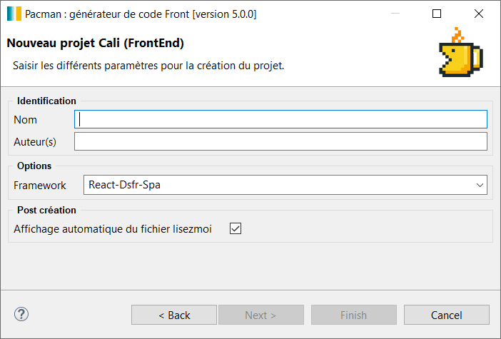
</div>

❗ Bien noter que le contrôle de la saisie est effectué en temps réel et que le bouton "*Finish*" ne sera pas activé tant que la saisie utilisateur n'aura pas passé l'ensemble des contrôles de cohérence. Il est donc important de toujours vérifier le message informatif en haut du formulaire afin de vérifier ce qui manque ou n'est pas conforme au niveau de la saisie.

Une fois la validation du formulaire effectuée en cliquant sur le bouton "*Finish*",  des vues vont être automatiquement activées (si certaines ne le sont pas déjà) au niveau de l'IDE. 
Il s'agit des vues suivantes : 

- **Properties** : La vue de saisie des propriétés par rapports aux modélisations.
- **Problems** : La vue concernant l'ensemble des problèmes sur l'application.
- **Progress** : La vue affichant la progression des tâches.
- **ErrorLog** : La vue concernant les erreurs et informations sur les générations.
- **JUnit** : La vue concernant les tests unitaires.
- **Récapitulatif pour le projet** : Si la case "*Affichage automatique du fichier lisezmoi*" a été cochée au niveau du formulaire de création du projet, vue affichant le récapitulatif HTML pour la création du projet.
- **Rapport de validation** : La vue qui permet de visualiser et corriger les différentes erreurs de validation (si présentes).

❗ Selon l'état de l'IDE (juste ouvert, développeur ayant déjà travaillé dessus, etc...), il se peut que la création initiale du projet prenne un peu de temps, l'IDE ayant besoin de charger de nombreuses ressources pour travailler. 

❗ Plus particulièrement, un temps d’attente est nécessaire lors du lancement du projet, car l’installation des dépendances node_modules peut prendre plusieurs minutes. Cette étape est indispensable au bon fonctionnement de l’application, puisqu’elle permet de télécharger et configurer l’ensemble des bibliothèques requises. La durée peut varier selon la configuration de l’environnement, la vitesse du réseau ou l’état du cache local, et doit être prise en compte lors de la première exécution ou après une mise à jour des dépendances.

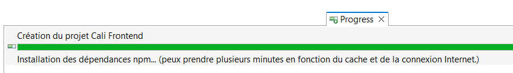

Suivre les différentes étapes de la création à l'aide de la vue de progression des tâches qui est automatiquement mise en avant. 

### Fichiers et répertoires Générés

Par la suite dans ce document le projet d'exemple sera appelé simplement "demo-dsfr". 

❗ Dans tous les fichiers et classes générées, il est possible de trouver des balises de type "*user code*". Ces balises ressemblent à ceci : 

```java
// Start of user code 56bcd4f8dd30c88089557e348b4165dc

// End of user code
```
Ces balises ont été positionnées à des endroits considérés comme stratégiques par le développeur du générateur, elles permettent par la suite de positionner du code personnalisé par le développeur de l'application cible sans que celui-ci soit par la suite, écrasé lors des prochaines demandes de génération. 

La structure créée pour le projet est la suivante : 

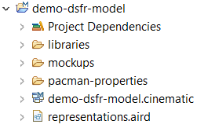
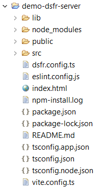

➤ Le projet "***demo-dsfr-model***" contient la couche de modélisation. Par défaut, le projet contient (au niveau des fichiers de modélisation) le fichier de stockage des représentations ***representation.aird*** ainsi que le fichier de modélisation pour la cinématique (enchainement des différents écrans).
  
Au niveau du répertoire ***/pacman-properties*** les deux fichiers de paramètrage sont toujours présents.  

❗ De même, si les fichiers de propriétés sont créés à la base pour des projets Java, il est encore une fois à préciser que seules, ici, quelques propriétés sont utilisés pour la génération des projets. Il ne faut donc pas s'étonner de la présence de certaines propriétés liées exclusivement à Java. Ces fichiers doivent obligatoirement être conservés pour le bon fonctionnement des générateurs.

Le fichier *project.properties* est quant à lui limité à sa plus stricte expression : 

```properties
# Le nom de l'application (sert de prefixe pour l'ensemble des projets)
project.name = demo-dsfr
# L'auteur par defaut pour les fichiers generes
project.author = xxxxxxxxxx
# Flag indiquant si le profiling est actif lors des generations
project.profiler.enabled = false
# Type de framework pour le projet (React par defaut)
project.framework.type = react
# La version de l'application
project.version = 
# Flag indiquant si la generation pour le projet fonctionne en mode debug (non par defaut)
project.debug.enabled = false
};
```

❗ Par ailleurs, il est possible de voir deux répertoires *libraries* et *mockup* qui sont aussi présents au niveau de l'image représentant la stucture du projet. Il est à noter que ces deux répertoires sont donnés ici à titre purement informatif afin d'être exhaustif, mais ils ne sont pas affichés dès la création du projet. Le répertoire *mockup* sera utilisé pour le stockage des images utilisées pour la modélisation des écrans et le répertoire *libraries* contiendra la modélisation pour la (ou les) librairie(s) d'appel des différents services de type REST.

➤ Le projet "***demo-dsfr-server***" dans lequel un répertoire (entre autres) est créé, il s'agit du répertoire "**/src**" (équivalent du "**/src/main/java**"). Ce répertoire sert de base (racine) pour l'ensemble de la génération, il va contenir l'ensemble des fichiers de configuration générés à la création du projet ainsi que l'ensemble des sources pour les objets métier et les différents services. 

❗ Une grande partie des fichiers générés est produite uniquement lors de la création initiale du projet et n’est pas mise à jour automatiquement par la suite. Il est donc possible pour le développeur de les modifier à loisir sans craindre un écrasement par une future génération. Pour cette raison, ces fichiers ne disposent pas de balises de type "*user code*".

Ce répertoire va donc contenir les répertoires suivants : 

• **/api** : ce répertoire contient le fichier "**apiClient.ts**" qui est responsable de la configuration et de l’initialisation du client HTTP utilisé pour communiquer avec l’API. Il s’appuie sur la bibliothèque Axios, largement utilisée pour la gestion des requêtes HTTP en JavaScript et TypeScript. Une configuration de base est importée depuis apiConfig, puis enrichie afin de garantir certains paramètres par défaut, notamment un timeout fixé à 15 secondes si aucune valeur n’est définie. 

Ce fichier met également en place des intercepteurs Axios, qui permettent d’intervenir automatiquement avant l’envoi des requêtes et après la réception des réponses. L’intercepteur de requête offre un point d’extension pour ajouter ultérieurement des en-têtes (comme un token d’authentification) ou modifier la configuration avant l’envoi. L’intercepteur de réponse, quant à lui, permet de gérer de manière centralisée les erreurs provenant de l’API, en les journalisant dans la console avant de les propager.

À partir de cette configuration, une instance Axios unique (apiClient) est créée, ce qui permet de centraliser et d’uniformiser tous les appels réseau de l’application.

Le fichier "**apiConfig.ts**" définit la configuration de base de l’API utilisée par l’application. Il crée une instance Axios dédiée à la définition des paramètres globaux de communication avec le backend. Le point d’entrée principal de l’API (baseURL) est récupéré via la variable d’environnement "**VITE_API_BASE_URL**", ce qui permet d’adapter automatiquement l’URL du backend selon l’environnement (développement, production). En l’absence de variable définie, une URL locale par défaut est utilisée afin de faciliter le développement.

Les en-têtes HTTP sont également configurés à ce niveau, avec un Content-Type défini sur *application/json*, garantissant que les échanges entre le frontend et le backend utilisent le format JSON.

Avec le fichier "**overrideApiClient.ts**", le code actuellement commenté, permet (si besoin) de synchroniser la configuration du client API du front-end avec celui fourni par une librairie externe. L’objectif est de remplacer (éventuellement) les propriétés de l’instance Axios exposée par la librairie par celles définies dans l’application front. Cette approche garantit que les deux clients partagent exactement la même configuration (URL de base, intercepteurs, headers, timeout, etc.), évitant ainsi les incohérences lors des appels réseau.

• **/assets** : contient des images par défaut. Placer ici les différentes images qui seront utilisées pour la génération des écrans.         

• **/contexts** : ce répertoire contient le fichier "**AuthContext.tsx**" qui met en place le contexte d’authentification global de l’application à l’aide de l’API Context de React. Il définit les types User et AuthContextType, qui structurent respectivement les informations utilisateur (nom et rôles) et les fonctionnalités exposées par le contexte (état de connexion, chargement, connexion, déconnexion et gestion des rôles). Le contexte "**AuthContext**" permet ainsi de partager l’état d’authentification de manière centralisée. 

Le composant "**AuthProvider**" encapsule la logique métier liée à l’authentification. Il gère l’état de l’utilisateur connecté ainsi qu’un indicateur de chargement utilisé lors de l’initialisation. Au démarrage de l’application, un mécanisme de rechargement automatique depuis le sessionStorage permet de restaurer la session utilisateur si elle existe, garantissant la persistance de la connexion lors d’un rafraîchissement de page.

La fonction "**login**" implémente par défaut une authentification simulée, destinée à des besoins de développement ou de démonstration. Elle valide des identifiants prédéfinis et associe des rôles spécifiques à l’utilisateur connecté. C'est donc au développeur de modifier manuellement ce fichier afin de le relier aux différents services REST qui gèrent l'authentification et la récupération des jetons.

• **/pages** : C'est au niveau de ce répertoire que seront générées toutes les pages issues de la modélisation.

• **/mocks** :  Ce répertoire va contenir les fichiers d'implémentations simulées pour des services. Ils sont utilisés principalement pendant le développement et les tests afin de découpler l’application de ses dépendances externes, comme par exemple une API backend. Ces mocks automatiquement générés à partir de la modélisation de la cinématique facilitent la mise au point de l’interface utilisateur, la validation du parcour fonctionnel, sans pour autant dépendre de la disponibilité ou de l’état du backend.

• **/security** :  Par défaut, ce répertoire contient uniquement le fichier "**ProtectedRoute.tsx**". Ce fichier permet de sécuriser l’accès aux routes de l’application en fonction de l’état d’authentification et, si nécessaire, des rôles de l’utilisateur. Il s’appuie sur react-router-dom et sur le contexte d’authentification fourni par "**AuthContext**" afin de centraliser la logique de protection des routes dans un composant unique et réutilisable. Si aucun utilisateur n’est connecté, l’accès à la route est bloqué et l’utilisateur est automatiquement redirigé vers la page de connexion. Lorsque la route protégée définit une liste de rôles autorisés, le composant vérifie que l’utilisateur dispose d’au moins l’un de ces rôles ; dans le cas contraire, une redirection vers une page d’accès non autorisé est effectuée.

Si toutes les conditions sont remplies, le composant autorise l’accès à la route.

• **/services** :   Ce répertoire peux contenir les fichiers d'appel pour les différents services REST (ceux non issus des librairies importées au niveau du répertoire **/lib** et écrits directement par le développeur).

Ainsi que les principaux fichiers : 

• **App.css** : contient les styles globaux de l’application. Il permet de définir l’apparence générale des composants, ainsi que les règles CSS communes utilisées à travers l’ensemble du projet.

• **App.tsx** : constitue le point d’entrée principal de l’application React. Il orchestre la structure globale de l’application en assemblant les différents fournisseurs de contexte, les routes et les composants racine. Ce fichier joue un rôle central dans l’organisation de l’architecture, car il définit comment les différentes briques fonctionnelles interagissent entre elles.

• **index.css** : définit les styles CSS globaux appliqués à l’ensemble de l’application dès son initialisation. Il est chargé au point d’entrée du projet et s’applique à tous les composants, indépendamment de leur niveau dans l’arborescence. Bien noter que **index.css** définit les styles de base et universels de l’application (reset, polices, couleurs globales), tandis que **App.css** contient les styles globaux spécifiques à la structure et à la mise en page de l’application.

• **main.tsx** : point d’entrée principal de l’application React. Il est responsable de l’initialisation de l’application côté client et du montage de l’arbre de composants React dans le DOM.

Par ailleurs, le projet contient : 

• le répertoire **/public/dsfr/pictograms** : ce répertoire contient une copie des pictogrammes nécessaires pour l'application (si besoin), il est nécessaire pour le développeur de recopier les différents pictogrammes à partir du répertoire "**/node_modules/dsfr/**".

• le répertoire **/node_modules** : contient l’ensemble des dépendances du projet installées via le gestionnaire de paquets npm. Il regroupe les bibliothèques externes nécessaires au fonctionnement de l’application, qu’il s’agisse de frameworks (comme React), d’outils de build, de librairies utilitaires ou de dépendances transverses. Son contenu est généré automatiquement à partir des fichiers de configuration (*package.json* et *package-lock.json* ou équivalent) et ne doit pas être modifié manuellement.


## 📝 Fichiers de configuration
---

❗  Dans le cadre des projets générés par Pacman, le fichier *package-lock.json* ne joue pas un rôle fonctionnel essentiel, puisque Pacman écrit lui-même les dépendances avec des versions figées dans le *package.json* (devDependencies, peerDependencies, etc.). Le rôle normal d’un *package-lock.json* est d’assurer une installation strictement reproductible des dépendances, en enregistrant les versions exactes réellement installées. Mais ici, comme les dépendances sont déjà imposées et contrôlées par Pacman, ce fichier ne sert pas à figer des choix du développeur — il ne fait que refléter l'état final de l'installation. 

Il reste néanmoins utile pour garantir que deux installations successives (ou deux postes différents) utiliseront exactement la même arborescence npm, évitant ainsi les légères variations possibles dans la résolution interne de npm, même lorsque les versions sont verrouillées. En bref : ce n’est pas indispensable pour Pacman, mais cela renforce la reproductibilité et évite les comportements imprévisibles de npm. Il reste toujours possible de le désactiver en mettant la propriété à "false" au niveau du fichier *.npmrc*.

#### dsfr.config.ts 

centralise un paramètre de configuration indiquant le chemin de base des assets statiques (CSS, JavaScript, icônes, polices, etc.) du DSFR (Design System de l’État français).

```ts
export default {
  "data-fr-assets-path": "/dsfr",
};
```

#### package.json

fichier de configuration central du projet. Il décrit le projet (nom, version, description) et surtout la liste des dépendances nécessaires à son fonctionnement ainsi que celles utilisées uniquement pour le développement. Il définit également des scripts permettant d’automatiser des tâches courantes comme le démarrage du serveur de développement, le build ou les tests. Les informations qu’il contient permettent aux gestionnaires de paquets (npm, yarn, pnpm) d’installer les bonnes bibliothèques et d’exécuter le projet de manière cohérente sur n’importe quel environnement.

```json
{
  "name": "vite-project",
  "private": true,
  "version": "0.0.0",
  "type": "module",
  "scripts": {
    "dev": "vite",
    "build": "tsc -b && vite build",
    "lint": "eslint .",
    "preview": "vite preview"
  },
  "dependencies": {
    "@codegouvfr/react-dsfr": "^1.26.0",
    "@gouvfr/dsfr": "^1.14.1",
    "react": "^19.1.1",
    "react-dom": "^19.1.1",
    "react-hook-form": "^7.45.0"
  },
  "devDependencies": {
    "@eslint/js": "^9.33.0",
    "@faker-js/faker": "^9.9.0",
    "@types/react": "^19.1.10",
    "@types/react-dom": "^19.1.7",
    "@types/react-router-dom": "^5.3.3",
    "@vitejs/plugin-react": "^5.0.0",
    "eslint": "^9.33.0",
    "eslint-plugin-react-hooks": "^5.2.0",
    "eslint-plugin-react-refresh": "^0.4.20",
    "globals": "^16.3.0",
    "react-router-dom": "^7.11.0",
    "typescript": "~5.8.3",
    "typescript-eslint": "^8.39.1",
    "vite": "^7.1.2"
  }
}
```

#### tsconfig.json

fichier de configuration du compilateur TypeScript. Il définit les règles de compilation du code TypeScript vers JavaScript, notamment la version cible du langage, le système de modules utilisé et le niveau de vérification des types. Il permet également de contrôler l’inclusion ou l’exclusion des fichiers du projet et d’activer des options de typage strict afin de détecter les erreurs le plus tôt possible.

```json
{
  "compilerOptions": {
    "target": "ESNext",
    "module": "ESNext",
    "lib": ["DOM", "ESNext"],
    "jsx": "react-jsx",
    "moduleResolution": "Node",
    "strict": true,
    "esModuleInterop": true,
    "skipLibCheck": true,
    "forceConsistentCasingInFileNames": true,
    "isolatedModules": true,
    "resolveJsonModule": true
  },
  "include": ["src"],
  "exclude": ["node_modules", "dist"]
}
```

#### tsconfig.node.json

configuration TypeScript dédiée à l’environnement *Node.js*. Il complète le fichier *tsconfig.json* principal en définissant des options de compilation spécifiques aux fichiers exécutés par Node, tels que les scripts de build, de configuration ou les fichiers comme vite.config.ts. Il permet notamment d’adapter le système de modules, la résolution des imports et la version JavaScript cible aux contraintes de Node.js, sans impacter la configuration utilisée pour le code frontend. Cette séparation garantit une meilleure organisation du projet et évite les conflits entre les besoins du navigateur et ceux de l’environnement serveur.

```json
{
  "compilerOptions": {
    "tsBuildInfoFile": "./node_modules/.tmp/tsconfig.node.tsbuildinfo",
    "target": "ES2023",
    "lib": ["ES2023"],
    "module": "ESNext",
    "skipLibCheck": true,

    /* Bundler mode */
    "moduleResolution": "bundler",
    "allowImportingTsExtensions": true,
    "verbatimModuleSyntax": true,
    "moduleDetection": "force",
    "noEmit": true,

    /* Linting */
    "strict": true,
    "noUnusedLocals": true,
    "noUnusedParameters": true,
    "erasableSyntaxOnly": true,
    "noFallthroughCasesInSwitch": true,
    "noUncheckedSideEffectImports": true
  },
  "include": ["vite.config.ts"]
}

```

#### tsconfig.app.json

configuration TypeScript dédiée au code de l’application frontend. Il définit les options de compilation appliquées aux fichiers exécutés dans le navigateur, en particulier les composants React, les hooks et la logique métier côté client. Ce fichier spécialise la configuration globale en adaptant des paramètres comme le support du JSX, la version JavaScript cible et les règles de typage aux contraintes du runtime navigateur.

```json
{
  "compilerOptions": {
    "tsBuildInfoFile": "./node_modules/.tmp/tsconfig.app.tsbuildinfo",
    "target": "ES2022",
    "useDefineForClassFields": true,
    "lib": ["ES2022", "DOM", "DOM.Iterable"],
    "module": "ESNext",
    "skipLibCheck": true,

    /* Bundler mode */
    "moduleResolution": "bundler",
    "allowImportingTsExtensions": true,
    "verbatimModuleSyntax": true,
    "moduleDetection": "force",
    "noEmit": true,
    "jsx": "react-jsx",

    /* Linting */
    "strict": true,
    "noUnusedLocals": true,
    "noUnusedParameters": true,
    "erasableSyntaxOnly": true,
    "noFallthroughCasesInSwitch": true,
    "noUncheckedSideEffectImports": true
  },
  "include": ["src"]
}

```
#### vite.config.ts

fichier de configuration de l’outil de build Vite. Il permet de définir le comportement du serveur de développement et du processus de build de l’application, notamment la gestion des plugins, la résolution des modules, les alias de chemins, les variables d’environnement et les options de compilation.

```ts
import { defineConfig } from 'vite'
import react from '@vitejs/plugin-react'

// https://vite.dev/config/
export default defineConfig({
  plugins: [react()],
  server: {
    port: 5173
  }
});

```

## 🛢 Génération de la cinématique
---

❗ Il est important de souligner que le méta-modèle cinématique est volontairement très ouvert et permissif. Une même fonctionnalité peut donc être modélisée de plusieurs façons. Des choix ont ainsi été nécessaires, notamment en fonction de la cible technique visée. Même si cela peut paraître peu intuitif au premier abord, une génération React n’a pas les mêmes contraintes ni les mêmes besoins qu’une modélisation en JSP ou en JSF. Il ne faut donc pas s’étonner, sur certains écrans de modélisation, d’accéder à certaines propriétés d’une manière spécifique ou de ne pas utiliser l’ensemble des fonctionnalités disponibles.

Cette documentation est basée sur un projet destiné à créer un site de gestion concernant la demande et le suivi de démarches administratives. Par exemple un utilisateur peux effectuer une demande d'obtention de carte grise ou de carte d'identité. Il n'est pas dans l'objectif de ce document d'expliciter l'ensemble de la modélisation mais de voir les bases essentielles pour la modélisation et la génération d'une page react, ainsi que l'appel à un service de type REST.

On peut noter dès maintenant que le fichier de modélisation cinématique contient deux diagrammes (représentations) par défaut qui sont respectivement : 

-	**Package Diagram** : Il s’agit du diagramme principal pour la modélisation, c’est par le biais de ce diagramme que les grandes lignes de la navigation et des interactions entre les différents écrans seront définies. C’est par ce diagramme que le développeur doit commencer sa modélisation.
 
-	**UI Structure** : Il s’agit ici d’un arbre représentant les différents composants de la modélisation (ceux décrits au niveau du *Package Diagram*).  

### Toolkit

A l’ouverture du diagramme pour la modélisation de la cinématique, toute tentative pour positionner un premier écran ("*ViewContainer*") va automatiquement se solder par le message suivant : 

<div align="center">
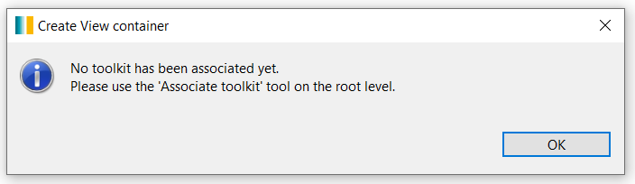
</div>

Le toolkit est un ensemble de composants graphiques (appelés *Widgets*) qui vont être utilisés dans le cadre de la composition des différents écrans de l’application. Ces composants peuvent être un ensemble de boutons, de listes déroulantes, de calendrier, de champs de type texte, etc…
Un toolkit est développé spécifiquement par le créateur du générateur, et ce,  pour un type de génération bien spécifique. Ainsi il est totalement déconseillé de ne pas utiliser le toolkit spécifiquement développé pour le type de génération à effectuer (dans notre cas une génération React) sous peine : 

-	D’avoir une génération incomplète, non fonctionnelle et contenant de nombreux effets de bord non prévus par le développeur du générateur.

-	De manière plus générale, de ne pas avoir l’ensemble des fonctionalités et composants initialement prévus.

Pour associer un toolkit au diagramme, deux possibilités s’offrent à l’utilisateur : 

-	En cliquant n’importe ou au niveau du diagramme qui est vide par défaut, faire apparaitre l’onglet "*Properties*" et se positionner au niveau du sous-onglet "*Toolkits*". A l’aide du bouton "*+*" associer le toolkit.

<div align="center">
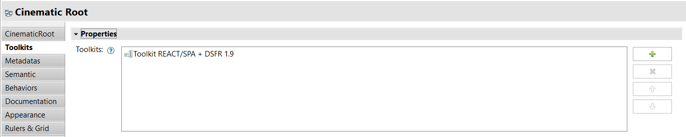
</div>

-	En effectuant un clic droit n’importe ou au niveau du diagramme qui est vide par défaut, choisir l’option "*Associate Tookit*".

<div align="center">
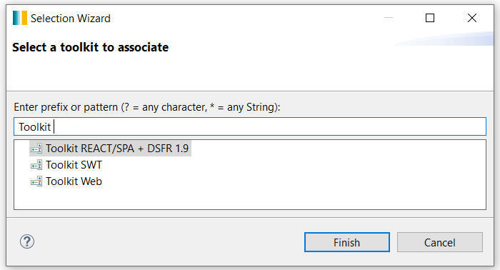
</div>

Dans les deux cas, sélectionner uniquement le toolkit : "*REACT/SPA + DSFR1.9*".

### Notions de base 

❗ Pour rappel, l'objectif de ce document n'est pas ici, d'expliciter l'utilisation des outils de modélisation qui sont censés être déjà connus par le développeur. Se reporter aux diverses documentations ad hoc pour la modélisation d'un fichier "*.cinematic*".

Cependant, avant de commencer une modélisation de type cinématique, il convient toutefois d’en rappeler rapidement les enjeux et principes fondamentaux. Dans les grandes lignes : 

-	Une cinématique est composée d’un ensemble d’écrans appelés "*ViewContainer*".

-	Chaque écran est relié à un (et un seul) contrôleur, appelé "*State*" (ou "*ViewState*"). Ce contrôleur permet de piloter les différents états de l’écran. Chaque contrôleur est relié à une et une seule page.

-	Un contrôleur peut (si besoin) appeler la couche de modélisation SOA (base de données ou autre) à l’aide d’actions ("*Action*"). Dans le cas d'une application de type React, il s'agira d'appeler les services REST.

-	Chaque contrôleur peut être relié avec un ou plusieurs autres contrôleurs par l’intermédaire de transitions ("*Transition*"), elles-même activées (ou executées) par le biais d’un ou plusieurs événements ("*Events*").

- Le "*package*" est simplement un conteneur qui permet d’organiser et de mieux répartir les différents écrans de l’application en unités logiques. Au moment de la génération, toutes les pages qui vont représenter les différents écrans seront alors réparties dans des répertoires dont les noms seront ceux définis par les noms de package. Il est bien evident que si la notion de package n’est pas obligatoire pour le bon fonctionnement de l’application. Pour l'instant cette notion n'a pas été prise en compte dans le cadre de la génération, toutes les pages générées sont donc directement sous le répertoire  : "*/pages*".

- La notion de "*Flow*" est  à peu près identique à celle de "*Package*"  mais plus orienté (comme sont nom l’indique) au niveau de la découpe logique des différents flux de l’application. De manière générale il est important  de comprendre que les notions de "*Package*" et de "*Flow*" se résument simplement en des conteneurs de haut niveau qui permettent de mieux structurer la modélisation de l’application en différentes unités logiques et ainsi de mieux visualiser les intéractions entre les différents domaines fonctionnels de cette dernière.

❗ Il est important de noter que dans le cadre de la modélisation React, la notion de "*Flow Events*" n'est pas utilisée pour l'instant.

Dans le cadre de cette application exemple, on peut voir ici que, au niveau du "*Package Diagram*", de nombreuses pages on été modélisées à l'aide du toolkit : 

<div align="center">
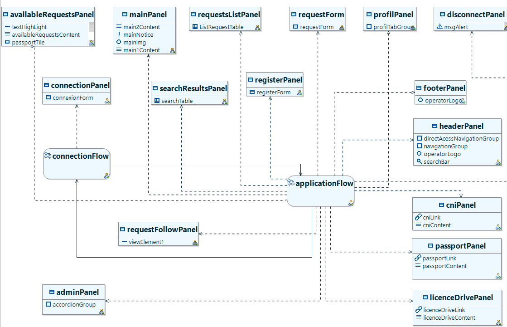
</div>

Il est fortement recommandé, en particulier pour les sites comportant un grand nombre de pages, de séparer les grandes fonctionnalités en plusieurs diagrammes de type *Flow* afin d’améliorer la lisibilité et d’offrir une meilleure visibilité sur chacune de ces fonctionnalités. Dans le cadre de cet exemple, la fonctionnalité de connexion a été positionnée dans un processus séparé (comme il est possible de le voir dans le diagramme ci-dessus). 

Les deux "*Flow*" peuvent alors communiquer ensemble à l'aide des différentes transitions qui ont été modélisées...

Ci-contre le "*Flow*" représentant le processus de connexion : 

<div align="center">
  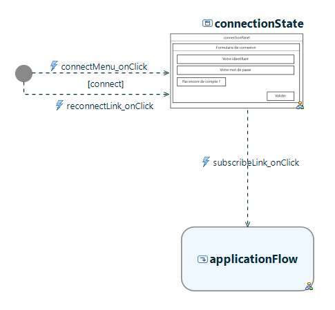
</div>

Ci-contre le "*Flow*" représentant le processus pour le reste de l'application : 

<div align="center">
  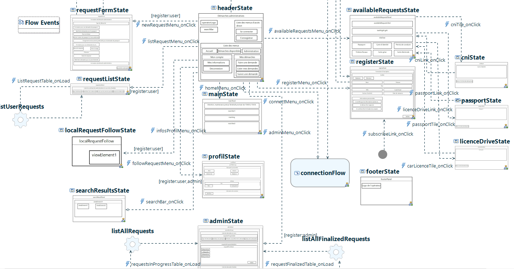
</div>

❗ Avec l'utilisation des composants DSFR, il est important de noter que le toolkit a du parfois diviser les différents composants en conteneurs et sous conteneurs. Ainsi par exemple, pour un composant de type "*Navigation*" (ensemble de composants qui gèrent la navigation vers les pages de l'application), il sera nécessaire de modéliser (par exemple) un "*GroupNavigation*" contenant un ou plusieurs "*NavigationElement*" ainsi qu'un ou plusieurs "*NavigationMenu*" contenant chacun un ou plusieurs "*NavigationElement*", etc...

La demande de génération pour la cinématique des écrans et accessible en se positionnant au niveau du fichier de modélisation ("*.cinematic*") et en effectuant un clic droit : 

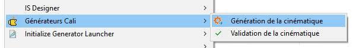

### Lancement du serveur

La commande "*npm run dev*" permet de démarrer le serveur de développement de l’application. Elle exécute le script défini dans le fichier '*package.json*' (associé à Vite) , qui lance un serveur local avec rechargement automatique. 

Concrètement, dès qu’un fichier du projet est modifié, l’application est recompilée et le navigateur se met à jour sans redémarrage manuel. Cette commande est utilisée uniquement en phase de développement : elle facilite les tests, le débogage et l’itération rapide, sans produire pour autant de version optimisée pour la mise en production.

Sous ISD, pour lancer le serveur, se positionner au niveau de l'onglet "*Terminal*" qui a été automatiquement monté et affiché lors de la création du projet. Par défaut le chemin du shell est positionné au niveau de la partie serveur pour le projet : **[Nom de l'application]-server**

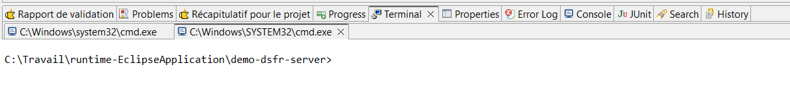

❗ Il est possible que le chemin du terminal se désynchronise parfois avec la projet qui est ouvert (surtout lors des ouvertures fermetures d'ISD), bien vérifier que le prompt soit situé sur le bon chemin et si besoin, effectuer les commandes nécessaires pour bien se repositionner.

Lancer la commande pour démarrer le serveur : 

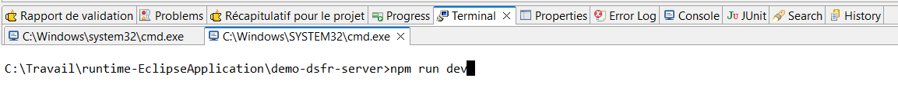

Vérifier le bon démarrage du serveur sur le port par défaut 5173 : 

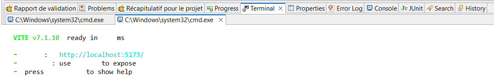

Le serveur est alors disponible sur l'adresse : *http://localhost:5173/* 

(page d'index pour l'application de démonstration).

<div align="center">
   
</div>

### 📄 En-tête et pied-page

#### Modelisation

Il est possible de rajouter pour l'ensemble de l'application un en-tête et un pied-de-page (ici modélisés au niveau du "*Package diagram*"). Pour ce faire définir deux "*ViewContainer*" au niveau du "*Package Diagram*"

<div align="center">
  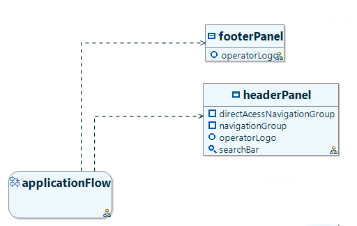
</div>

Voici la modélisation ("*mockup*") pour la page d'en-tête avec l'ensemble des menus de navigation.        

<div align="center">
  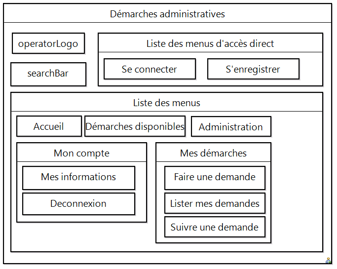
</div>

La structure des différents éléments est la suivante (liste des éléments) : 

<div align="center">
  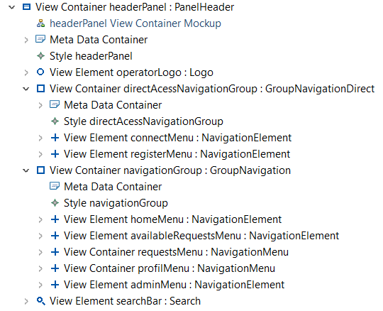
</div>

Voici la modélisation ("*mockup*") pour le pied-de-page avec l'ensemble des menus de navigation. 

<div align="center">
  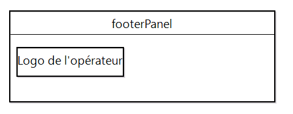
</div>

La structure des différents éléments est la suivante (liste des éléments) : 

<div align="center">
  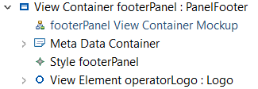
</div>

Au niveau du "*Flow*" chaque page est reliée à un "*viewState*", par exemple, avec la page d'en-tête, cette dernière est reliée au "*viewState*" : "*headerState*". De nombreuses transitions ont été tirées entre ce contrôleur et les autres contrôleurs. Pour rappel, chaque transition est associée à un évenement qui est lui même attaché à un des éléments ("*widgets*"), ainsi la transition est activée uniquement au momment du déclanchement de l'événement associé à l'élément. Pour attacher l'événement, simplement faire un double-click au niveau de la transition afin d'afficher la fenêtre de sélection de l'événement : 

<div align="center">
  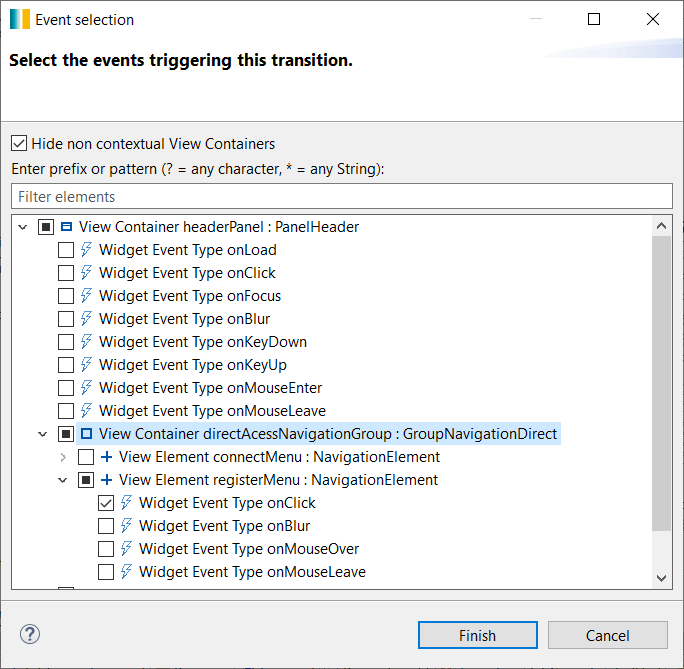
</div>

Sinon il est aussi possible en sélectionnant la transition, d'afficher l'onglet "*Properties*" et de sélectionner l'évenement dans la rubrique "*On*" sur le sous-onglet principal "*Transition*".

#### Génération 

Voici, à titre purement indicatif le code généré suite à la modélisation de l'en-tête vue précédemment. Dans le cadre de ce document on se concentrera plutôt sur la notion d'en-tête puisque la notion de pied-de-page fonctionne excatement sur la même logique. Ce code est relativement long mais il permet de bien voir l'agencement du code effectué par le générateur **Pacman**. De manière générale il a été essayé de centraliser au maximum les différents processus.

```ts
import React from "react";
import { useEffect, useState } from "react";
import { useNavigate, useLocation } from "react-router-dom";
import { useAuth } from "../contexts/AuthContext";
import { headerFooterDisplayItem } from "@codegouvfr/react-dsfr/Display";
import { Header } from "@codegouvfr/react-dsfr/Header";
import { MainNavigation } from "@codegouvfr/react-dsfr/MainNavigation";
import { SearchBar } from "@codegouvfr/react-dsfr/SearchBar";
import opLogo from "../assets/imgs/logo.png";

// Start of user code 258d49857d873964a270e9f16d42ed3b
// End of user code

export default function HeaderPanel () {
  
  // --------------------------------
  // Gestion générique de la sécurité.
  // --------------------------------
  const { login, user, logout } = useAuth();
  
  // -----------------------------------
  // Gestion centralisée de la recherche. 
  // -----------------------------------
  const [searchTerm, setSearchTerm] = useState("");
  const navigate = useNavigate();
  const location = useLocation();
  
  const handleSearch = () => {
    if (!searchTerm.trim()) return;
    console.log("Recherche effectuée :", searchTerm);
    navigate(`/#?q=${encodeURIComponent(searchTerm)}`);
  };
  
  // Start of user code 81ff458cc35f5f2bacf011b54169477c
  // End of user code
  
  return (
    <>
      <Header
        allowEmptySearch
        clearSearchInputOnSearch
        brandTop={<>REPUBLIQUE<br/>FRANCAISE</>}
        homeLinkProps={{
        href: "/",
        title: "Site des démarches administratives locales"
      }}
      id="headerPanel"
      serviceTagline="Simplifiez vos démarches avec toutes les administrations à portée de clic !"
      serviceTitle="Démarches administratives"
      operatorLogo={{
        alt: "",
        imgUrl: opLogo,
        orientation: "horizontal"
      }}
      onSearchButtonClick={function noRefCheck(){}}
      navigation={[
        {  
           isActive: location.pathname === "/",
           linkProps: {
             href: "/"
           },
           text: "Accueil"
         },
       
        {  
           isActive: location.pathname === "/gotToAvailableRequests",
           linkProps: {
             href: "/gotToAvailableRequests"
           },
           text: "Démarches disponibles"
         },
       
      ...(user && ["admin"]
          .some(role => user.roles?.includes(role)) ? [
        {  
           isActive: location.pathname === "/goToAdmin",
           linkProps: {
             href: "/goToAdmin"
           },
           text: "Administration"
         },
       ] : []),
      
       ...(user && ["user"]
           .some(role => user.roles?.includes(role)) ? [
       {
         isActive: ["/goToNewRequest","/gotToListRequest","/goToFollowRequest",].includes(location.pathname),
         menuLinks: [
         ...(user && ["user"]
             .some(role => user.roles?.includes(role)) ? [
           {
             linkProps: {
             href: "goToNewRequest"
           },
           isActive: location.pathname === "/goToNewRequest",
           text: "Faire une demande"
         },
         ] : []),
         ...(user && ["user"]
             .some(role => user.roles?.includes(role)) ? [
           {
             linkProps: {
             href: "gotToListRequest"
           },
           isActive: location.pathname === "/gotToListRequest",
           text: "Lister mes demandes"
         },
         ] : []),
         ...(user && ["user"]
             .some(role => user.roles?.includes(role)) ? [
           {
             linkProps: {
             href: "goToFollowRequest"
           },
           isActive: location.pathname === "/goToFollowRequest",
           text: "Suivre une demande"
         },
         ] : []),
         ],
         text: "Mes démarches"
       },
       ] : []),
       ...(user && ["user", "admin"]
           .some(role => user.roles?.includes(role)) ? [
       {
         isActive: ["/goToProfil","/goToDisconnect",].includes(location.pathname),
         menuLinks: [
         ...(user && ["user", "admin"]
             .some(role => user.roles?.includes(role)) ? [
           {
             linkProps: {
             href: "goToProfil"
           },
           isActive: location.pathname === "/goToProfil",
           text: "Mes informations"
         },
         ] : []),
           {
             linkProps: {
             href: "goToDisconnect"
           },
           isActive: location.pathname === "/goToDisconnect",
           text: "Deconnexion"
         },
         ],
         text: "Mon compte"
       },
       ] : []),
       
      ]}
         quickAccessItems={[
         {
           iconId: "fr-icon-lock-line",
           linkProps: {
             href: "/goToConnexion"
           },
         text: "Se connecter"
         },
         {
           iconId: "fr-icon-user-add-line",
           linkProps: {
             href: "/goToRegister"
           },
         text: "S'enregistrer"
         },
         headerFooterDisplayItem
         ]}
      />
    </>
  );
}
```

Ce code appelle quelques explications supplémentaires : 

Ce composant définit donc l’en-tête principal de l’application en s’appuyant sur les composants du DSFR React. Il gère l’affichage du logo, du titre du service, de la navigation et des accès rapides, tout en adaptant dynamiquement le contenu du menu en fonction de l’état d’authentification et des rôles de l’utilisateur grâce au hook "*useAuth*". 

Les liens et sous-menus (démarches, compte, administration) sont affichés ou masqués selon les droits, et l’état actif des éléments est calculé à partir de l’URL courante via useLocation. Le composant centralise également la logique de recherche et de navigation avec useNavigate, ce qui en fait un point clé pour la navigation globale et la sécurité côté interface.

"*useAuth*" permet de récupérer l’utilisateur courant et ses rôles. Ces informations sont ensuite utilisées pour construire dynamiquement le menu de navigation : certaines entrées sont affichées uniquement pour les utilisateurs authentifiés, d’autres sont réservées aux rôles user ou admin. Cette logique repose sur des conditions combinant la présence de l’utilisateur et la vérification de ses rôles, ce qui garantit que seules les fonctionnalités autorisées sont visibles dans l’interface.

```ts
isActive: ["/goToNewRequest", "/gotToListRequest", "/goToFollowRequest"]
  .includes(location.pathname)
```

Ce type de code sert à déterminer si un menu parent doit être considéré comme actif en fonction de la route courante. Concrètement, "*location.pathname*" contient le chemin de l’URL actuellement affichée au niveau du navigateur. Le tableau regroupe toutes les routes associées aux sous-fonctionnalités du menu. La méthode includes vérifie si la route courante correspond à l’une de ces valeurs.
Si c’est le cas, isActive est positionné à la valeur "*true*", ce qui permet de mettre en surbrillance le menu principal, même lorsque l’utilisateur se trouve sur une sous-page. Cette approche garantit une cohérence visuelle de la navigation et indique clairement à l’utilisateur dans quelle section fonctionnelle il se situe.

### 🔒 Sécurisation des accès

La sécurité regroupe l’ensemble des mécanismes visant à protéger les données, les utilisateurs et l’application elle-même contre les accès non autorisés (entre autres). Elle repose notamment sur l’authentification des utilisateurs et la gestion des autorisations (droits et rôles).

#### Modélisation

❗ Dans le cas ou l'accès à une page est limité à une authentification et/ou à un rôle spécifique, il est possible de l'indiquer au niveau de la rubrique "*Guard*" du sous-onglet "*Transition*" de l'onglet "*properties*" pour la transition. Si on reprend la page d'en-tête avec l'ensemble des menus de navigation, différentes transitions ont été modélisées, chacune avec une "*Guard*" spécifique. Il suffit simplement d'indiquer le mot clé "*register*", suivi de "*:*", suivi de la liste des rôles (*register:[rôle 1,rôle 2,rôle 3..]*). 

Par exemple : 

- *register:admin*
- *register:user,admin*

Il est par ailleurs possible de voir directement la gestion de la sécurité au niveau du diagramme : 

<div align="center">
  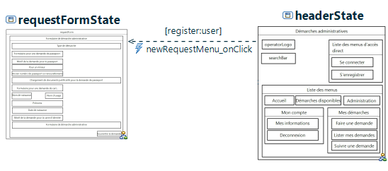
</div>

Au niveau des éléments il est aussi possible pour une page de les afficher ou de les supprimer et fonction de l'utilisateur connecté. Il n'y a rien à faire de particulier, à partir du moment ou le générateur détecte une transition avec une "*Guard*" associée à l'élément, le code est alors automatiquement rajouté pour gérer l'affichage de l'élément en fonction de l'utilisateur qui est connecté.

Le corrolaire à ce système de fonctionnement est qu'il existe une métadonnées positionnable sur l'élément qui permet de forcer sont affichage dans certains cas spécifique. Par exemmple dans l'application de démonstration, il existe un menu déroulant "*Mon compte*" avec deux sous-menus, respectivement "*Mes informations*" et "*Deconnexion*". Ces deux sous-menus ne peuvent apparaitre que si la personne est connectée à l'application (authentifiée). Dans ce cas, positionner la métadonnée "*WITH_FORCE_SECURED*" avec la velur "*true*" au niveau du conteneur : 

<div align="center">
  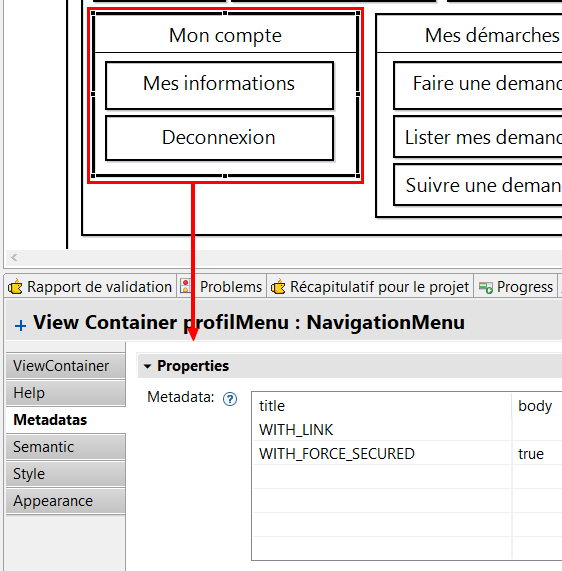
</div>

#### Génération

Lors de la génération la table de routes est automatiquement regénérée au niveau du fichier centralisé  "*App.tsx*".

La configuration du routage est effectuée à l’aide de React Router. Le composant "*App*" encapsule ici l’ensemble de l’application dans un "*BrowserRouter*" et déclare les différentes routes accessibles via le composant "*Routes*". Certaines routes sont protégées par le composant "*ProtectedRoutes*", qui restreint l’accès en fonction des rôles de l’utilisateur.

```ts
function App() {
  return (
    <Router>
      <Layout>
      <Routes>  
        <Route path="/goToConnexion" element={< ConnectionPanel />}/>
        // Double l'url pour une url fixe en provenance de AuthContext.tsx
        <Route path="/login" element={< ConnectionPanel />}/>
        <Route path="/goToReconnect" element={< ConnectionPanel />}/>
        <Route element={<ProtectedRoutes roles={["user", "admin"]} />}>
          <Route path="/goToProfil" element={< ProfilPanel />}/>
        </Route>
        <Route element={<ProtectedRoutes roles={["user"]} />}>
          <Route path="/goToNewRequest" element={< RequestForm />}/>
        </Route>
        <Route path="/" element={< MainPanel />}/>
        <Route element={<ProtectedRoutes roles={["user"]} />}>
          <Route path="/gotToListRequest" element={< RequestsListPanel />}/>
        </Route>
        <Route element={<ProtectedRoutes roles={["user"]} />}>
          <Route path="/goToFollowRequest" element={< RequestFollowPanel />}/>
        </Route>
        <Route path="/gotToAvailableRequests" element={< AvailableRequestsPanel />}/>
        <Route path="/gotToAvailableRequests" element={< AvailableRequestsPanel />}/>
        <Route path="/gotToAvailableRequests" element={< AvailableRequestsPanel />}/>
        <Route path="/gotToAvailableRequests" element={< AvailableRequestsPanel />}/>
        <Route path="/goToCni" element={< CniPanel />}/>
        <Route path="/goToRegister" element={< RegisterPanel />}/>
        <Route path="/goToRegister" element={< RegisterPanel />}/>
        <Route path="/gotToPassword" element={< PassportPanel />}/>
        <Route path="/gotToLicenceDrive" element={< LicenceDrivePanel />}/>
        <Route path="/gotToSearchPanel" element={< SearchResultsPanel />}/>
        <Route path="/goToDisconnect" element={< DisconnectPanel />}/>
        <Route element={<ProtectedRoutes roles={["admin"]} />}>
          <Route path="/goToAdmin" element={< AdminPanel />}/>
        </Route>
      </Routes>
      </Layout>
    </Router>
  );
}
```

A titre informatif, voici le code de gestion pour "*ProtectedRoutes*" : 
```ts
import React from "react";
import { Navigate, Outlet } from "react-router-dom";
import { useAuth } from "../contexts/AuthContext";

type ProtectedRoutesProps = {
  roles?: string[]; 
};

export default function ProtectedRoutes({ roles }: ProtectedRoutesProps) {
  const { user, hasRole, loading } = useAuth();
  if (loading) {
    return <div>Chargement...</div>; // ou un spinner DSFR
  }
  if (!user) {
    return <Navigate to="/login" replace />;
  }
  if (roles && roles.length > 0 && !roles.some((r) => hasRole(r))) {
    return <Navigate to="/unauthorized" replace />;
  }
  return <Outlet />;
}
```
Ce composant met en œuvre un mécanisme de protection des routes basé sur l’état d’authentification et les rôles de l’utilisateur. Il s’appuie sur le contexte d’authentification ("*useAuth*") pour récupérer l’utilisateur courant, l’état de chargement et une fonction de vérification des rôles. 

Tant que l’authentification est en cours de chargement, un écran d’attente est affiché. Si aucun utilisateur n’est connecté, la navigation est automatiquement redirigée vers la page de connexion. Lorsque des rôles sont spécifiés, le composant vérifie que l’utilisateur possède au moins l’un des rôles requis ; dans le cas contraire, il redirige vers une page d’accès non autorisé. 

Si toutes les conditions sont satisfaites, le composant rend simplement un "*Outlet*", permettant ainsi l’affichage des routes enfants protégées. Ce pattern permet de centraliser la logique de sécurité et d’éviter de la dupliquer dans chaque page.

De même, au niveau de chaque page, les différents composants peuvent être affichés ou non en fonction de l'utilisateur connecté, ceci à l'aide de la portion de code suivante (exemple pour l'affichage des menus) : 

```ts
user && ["user", "admin"].some(role => user.roles?.includes(role))
```

Ici cette condition vérifie qu'un utilisateur est présent (user existe) et qu'il possède au moins l’un des rôles *user* ou *admin*. Si la condition est fausse, rien n’est ajouté au menu.

Par ailleurs toute page qui doit gérer de la sécurité à automatiquement ce code au niveau de premières déclarations.  En pratique, cette ligne rend ces trois éléments directement accessibles dans le composant, sans avoir à rappeler useAuth() à chaque fois, ce qui simplifie la gestion de l’authentification et la construction des interfaces conditionnelles selon l’état de connexion.

```ts
// --------------------------------
// Gestion générique de la sécurité.
// --------------------------------
const { login, user, logout } = useAuth();
```

Pour rappel la gestion de la sécurité est à mettre en relation avec le fichier "*AuthContext.tsx*" situé au niveau du répertoire "*/src/contexts*". Ce fichier est à mettre à jour manuellement par l'utilisateur en fonction des différents services appelés pour l'authentification et l'identification de l'utilisateur. Par défaut le code de ce fichier est le suivant : 

```ts
import React, { createContext, useContext, useState, useEffect } from "react";

type User = {
  username: string;
  roles: string[];
};

type AuthContextType = {
  user: User | null;
  loading: boolean;
  login: (username: string, password: string) => Promise<boolean>;
  logout: () => void;
  hasRole: (role: string) => boolean;
};

const AuthContext = createContext<AuthContextType | undefined>(undefined);

export const AuthProvider: React.FC<{ children: React.ReactNode }> = ({ children }) => {

  const [user, setUser] = useState<User | null>(null);
  const [loading, setLoading] = useState(true);
  
  // --------------------------------------------
  // Rechargement automatique depuis localStorage
  // --------------------------------------------
  useEffect(() => {
    const storedUser = sessionStorage.getItem("user");
    if (storedUser) {
      setUser(JSON.parse(storedUser));
    }
    setLoading(false);
  }, []);

  // ----------------------------------------
  // Persistance automatique de l’utilisateur
  // ----------------------------------------
  useEffect(() => {
    if (user) sessionStorage.setItem("user", JSON.stringify(user));
    else sessionStorage.removeItem("user");
  }, [user]);

  // ----------------------------------
  // Connexion (simulée pour l’instant)
  // ----------------------------------
  async function login(username: string, password: string): Promise<boolean> {
    console.log("Tentative de connexion :", username, password);

    if (username === "12345" && password === "azerty") {
      console.log("Utilisateur connecté :", { username });
      setUser({ username, roles: ["user"] });
      return true;
    }

    if (username === "admin" && password === "admin") {
      console.log("Administrateur connecté :", { username });
      setUser({ username, roles: ["admin"] });
      return true;
    }
    console.log("Authentification échouée");
    return false;
  }
  
  // -----------
  // Déconnexion
  // -----------
  function logout() {
    setUser(null);
  }
  
  // ----------------------
  // Vérification des rôles
  // ----------------------
  function hasRole(role: string): boolean {
    return user?.roles.includes(role) ?? false;
  }

  return (
    <AuthContext.Provider value={{ user, loading, login, logout, hasRole }}>
      {children}
    </AuthContext.Provider>
  );
};

// ----------------------------------------
// Hook pour simplifier l’accès au contexte
// ----------------------------------------
export function useAuth(): AuthContextType {
  const context = useContext(AuthContext);
  if (!context) throw new Error("useAuth must be used within AuthProvider");
  return context;
}
```

❗ Ici il faut bien considérer ici que, dans le code généré par défaut, il faut bien distinguer la notion de "*user*" qui est le contenant (la définition) pour un utilisateur connecté ... 

```ts
type User = {
  username: string;
  roles: string[];
};
```
... et la notion de rôle qui (encore une fois pas défaut) contient deux valeurs, définies comme "*user*" et "*admin*". On à donc dans tous les cas un "*user*" qui peut avoir soit le rôle "*user*", soit le rôle "*admin*". 

❗ ❗  Si le développeur à tout loisir de modifier le fichier "*AuthContext.tsx*", et de positionner les différents rôles définis pour son application, il est cependant totalement interdit de modifier le nom pour le conteneur de la définition de l'utilisateur (code vu ci-dessus). En effet, ce nom est par la suite utilisé dans la génération des différentes pages. 

Ce code met en place un contexte d’authentification global dans une application React afin de centraliser la gestion de la connexion utilisateur. Il permet de stocker l’utilisateur connecté et ses rôles, de gérer la connexion et la déconnexion, et de conserver la session via le sessionStorage même après un rafraîchissement de la page. Grâce au Context API et à un hook personnalisé, les informations d’authentification et les fonctions associées sont accessibles facilement depuis n’importe quel composant de l’application, ce qui simplifie la mise en place de routes protégées et de contrôles d’accès basés sur les rôles.

La fonction "*login([...])*" simule une authentification, elle vérifie les identifiants, définit l’utilisateur et ses rôles, elle retourne la valeur "*true*" ou "*false*" selon le succès. Cette fonction est asynchrone pour pouvoir être remplacée plus tard par un appel API réel.

Un hook dans React est une fonction spéciale qui permet d’utiliser les fonctionnalités internes de React, comme l’état, le cycle de vie ou les contextes, sans écrire de composant de classe. Les hooks permettent d’ajouter de la logique réutilisable à des composants fonctionnels, tout en gardant un code plus simple et plus lisible. 

Le hook personnalisé "*useAuth*" fournit une abstraction simple pour accéder au contexte d’authentification de l’application. Il permet de récupérer directement les informations et fonctions liées à l’authentification sans appeler explicitement useContext, ce qui améliore la lisibilité du code. Il garantit également que le contexte est utilisé à l’intérieur du AuthProvider, en levant une erreur (message délibirément laissé en anglais) si ce n’est pas le cas, et évite ainsi les usages incorrects tout en centralisant l’accès à la logique d’authentification. 

Voici le rendu si aucun utilisateur n'est encore authentifié :

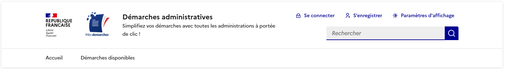

Voici le rendu avec un utilisateur authentifié :

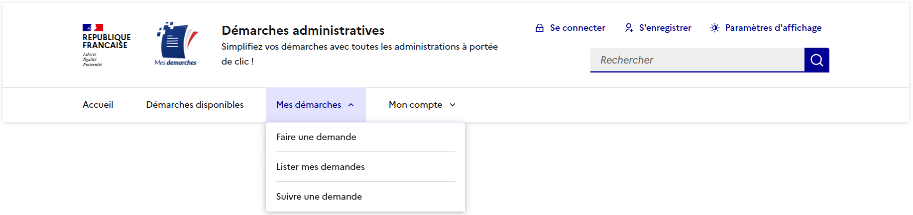
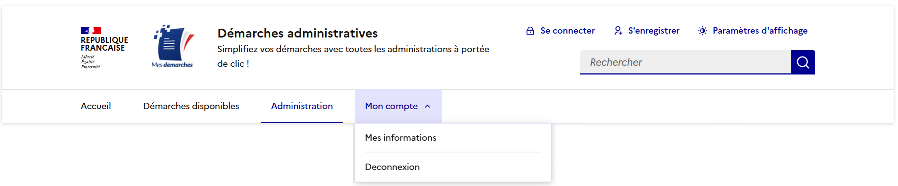

Enfin, le rendu si l'utilisateur est un administrateur :

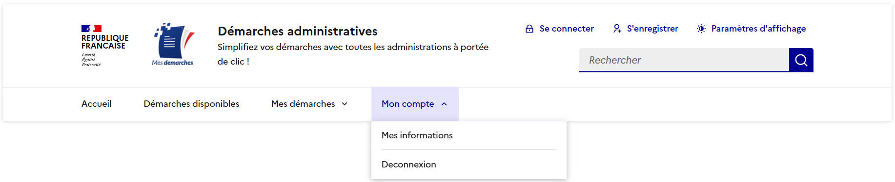


### 📄 Formulaire

Elément central d’un site web permettant à l’utilisateur de saisir et transmettre des données à l’application. Il constitue le principal moyen d’interaction entre l’interface et la logique métier, que ce soit pour une authentification, une recherche ou une demande spécifique. La conception d’un formulaire repose sur plusieurs aspects essentiels : la clarté des champs, la validation des données (pour éviter les erreurs ou les entrées invalides), la gestion des retours utilisateur et la sécurité des informations transmises.

Ici, la gestion des formulaires est en grande partie déléguée aux composants du DSFR. Ces composants fournissent des champs, des labels et des messages d’erreur conformes aux standards d’accessibilité et d’ergonomie, ce qui permet de se concentrer principalement sur la logique métier et la validation des données. En s’appuyant sur le DSFR, la structure, le comportement et l’affichage des formulaires sont harmonisés, tout en garantissant une expérience utilisateur cohérente et conforme aux bonnes pratiques des sites institutionnels.

#### Modélisation

Pour cet exemple, nous allons prendre l'écran d'enregistrement d'une démarche administrative. Cet écran permet à l'utilisateur de sélectionner le type de demande désiré et, en fonction de ce type, d'afficher le formulaire adéquat. Un contrôle de surface est alors effectué en temps réel (saisie utilisateur) puis le formulaire est envoyé par l'intermédiaire d'un service REST au backend.

La modélisation de la page est la suivante (vue "*Package Diagram*"): 

<div align="center">
    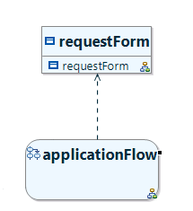
</div>

Ici est présentée la vue du "*mockup*" : 

<div align="center">
    
</div>

Le champ "*Type de démarche*" permet de piloter l'affichage des autres champs en fonction de la saisie utilisateur (boîte de sélection). Les différentes valeurs possibles sont enregistrées sous la forme de métadonnées. Pour accéder aux métadonnées, sélectionner l'élément désiré, se positionner au niveau de l'onglet "*Properties*", puis au niveau du sous-onglet "*Metadatas*". 

Ci-contre la modélisation pour ce champ spécifique : 

❗ Comme précité, il n'est pas ici dans l'objectif de ce document de revenir en détail sur l'ensemble de la procédure de modélisation qui est censée être déjà connue par l'utilisateur. Quelques focus seront toutefois donnés par rapport aux spécificités liées à l'utilisation des composants DSFR.

<div align="center">
    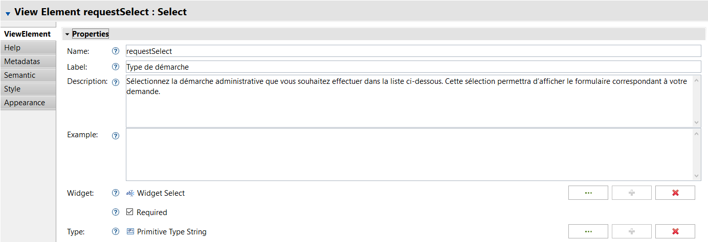
</div>

- La rubrique "*Description*" est utilisée pour mettre un texte explicatif qui sera affiché directement sous le libellé du champ.

- Ne pas oublier de toujours sélectionner un type pour le champ.

<div align="center">
    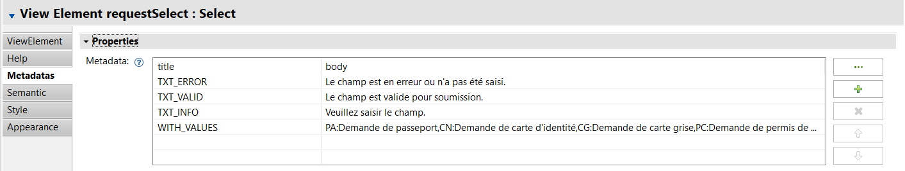
</div>

Au niveau des métadonnés : 

- **TXT_INFO** : Texte affiché par défaut avant la saisie utilisateur.
- **TXT_ERROR** :  Texte affiché sur erreur de saisie utilisateur (temps réel sur saisie).
- **TXT_VALID** : Texte affiché sur saisie valide de l'utilisateur (temps réel sur saisie).
- **WITH_VALUES** : La liste des valeurs à afficher dans la liste de sélection. Les valeurs sont sous la forme : "*[Valeur 1]:[Libellé valeur 1],[Valeur 2]:[Libellé valeur 2], etc...*"


Comme mentionné précédemment, l'affichage des autres champs est ici dépendant de la valeur sélectionnée au niveau de cette liste déroulante. Il est donc nécessaire de rajouter pour chaque modélisation de champ du code spécifique afin de gérer cet affichage. Pour ce faire tous les champs disposent d'une métadonnées "*WITH_CUSTOM_CODE*" ou (comme son nom l'indique), il est possible de rajouter directement au niveau de la modélisation une ligne de code bien spécifique, impossible à deviner pour le générateur **Pacman**. Cela laisse donc une certaine liberté pour le développeur.

Dans le cadre de cette exemple la ligne de code à rajouter est la suivante (par exemple pour le champ qui affiche le titre "*Formulaire pour une demande de passeport*") :

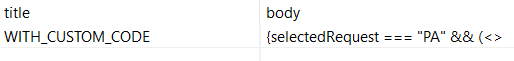

Ainsi le champ sera affiché uniquement si la valeur de la liste déroulante est à "*PA*", soit "Demande de Passeport".

❗ Attention ici il y a une petite astuce... grâce à la portion de code renseignée, il suffit simplement de positionner la métadonnée au niveau du premier champ à afficher pour le formulaire (ici le titre pour le formulaire), cela évite d'avoir à renseigner l'ensemble des champs. Ainsi la seconde métadonnée est à positionner uniquement au niveau de l'élément concernant le titre pour le formulaire de la carte d'identité, en fermant la balise à l'aide du code suivant (tous les champs de saisie sont donc englobés dans la condition) : 

```ts
</>)} {selectedRequest === "CN" && (<>
```
etc...

Enfin pour fermer la dernière portion, le code suivant a été simplement positionné au niveau du bouton de validation du formulaire: 

```ts
</>)} 
```

Au niveau de l'élément représentant le formulaire, les valeurs suivantes ont aussi été renseignées : 

- **TXT_ERROR** :  Texte affiché en cas d'erreur de saisie à l'envoi du formulaire. Ici il ne s'agit pas de la validation des contrôles de surface mais par exemple des contrôles fonctionnels.

- **TXT_VALID** : Texte affiché sur validation de la saisie (envoi au service REST).

#### Génération

A la génération le code produit est le suivant (pour raison de lisibilité ce code est découpé en plusieurs parties, avec pour chaque partie une explication). Voici en premier quelques exemples pour le codage des différents élements du formulaire. Il est bien évidemment impossible d'être exhaustif sur l'ensemble des composants du DSRF, sont donc donnés ici un exemple pour un champ text et un exemple pour une liste déroulante.

Ci-contre le codage d'un champ de type "Text" : 

```ts
<Input 
  label="Nom d'usage"
  hintText=""
  nativeInputProps={{
  ...getRegisterProps("usageFirstName", { 
  }),
  type:"text",
  placeholder: "",
  maxLength: 15
  }}
  state={fieldState("usageFirstName")}
  stateRelatedMessage={fieldMessage(
     "usageFirstName",
     "Veuillez saisir le champ",
     "Le champ est valide"
  )}
/>
```
Le composant définit un champ texte intitulé "Nom d’usage", dont les propriétés HTML natives (type, longueur maximale, placeholder) sont passées via "*nativeInputProps*". L’appel à "*getRegisterProps*" permet de lier ce champ au système de gestion de formulaire (enregistrement de la valeur, validation, suivi des erreurs), tandis que "*fieldState*" et "*fieldMessage*" contrôlent l’état visuel du champ (valide ou en erreur) ainsi que le message associé.

Le codage d'un champ de type "Liste déroulante"

```ts
<Select
   label="Motif de la demande pour le passeport"
   hint=""
   nativeSelectProps={{
   defaultValue: "",
     ...register("purposePassRequestSelect", { required: "Le champ est en erreur" }),
     // Start of user code f33cd45f2a9f1e0f08653843f7d28bee
     // End of user code
   }}
   state={errors.purposePassRequestSelect ? "error" : dirtyFields.purposePassRequestSelect ? "success" : "info"}
       stateRelatedMessage={
       errors.purposePassRequestSelect?.message ||
       (dirtyFields.purposePassRequestSelect ? "Le champ est valide" : "Veuillez saisir le champ")
   }
>
  <option value="">Selectionnez une option</option>
  <option value="PD">Première demande</option>
  <option value="RE">Renouvellement</option>
  <option value="PE">Perte</option>
  <option value="VO">Vol</option>
</Select>
```
Le composant affiche une liste déroulante permettant à l’utilisateur de choisir le motif d’une demande de passeport, avec une valeur par défaut vide afin de forcer une sélection explicite. Le champ est relié au système de gestion de formulaire via la fonction "*register*", ce qui permet de gérer la valeur, la validation (champ requis) et les erreurs associées. Les propriétés "*state*" et "*stateRelatedMessage*" pilotent dynamiquement le retour visuel du champ (information, succès ou erreur) en fonction de son état de validation ("*errors*" et "*dirtyFields*").


Le composant "*\<form\>*" encapsule l’ensemble des champs et associe l’événement de soumission ("*onSubmit*") à la fonction "*handleSubmit*". Cette fonction intercepte l’envoi du formulaire afin d’exécuter la logique définie dans "*onSubmit*", généralement après validation des données. L’utilisation du fragment React *(<>...</>)* permet de regrouper les éléments sans ajouter de nœud supplémentaire à l'arbre du DOM.

```ts
return (
  <>
  <form onSubmit={handleSubmit(onSubmit)}>
  </>
);
```

La définition de FormValues permet de typer tous les champs du formulaire, assurant la validation et l’autocomplétion TypeScript.

```ts
type FormValues = {
  requestSelect : string;
  purposePassRequestSelect : string;
  oldPasswordInput : string;
  firstName : string;
  lastNamesForCni : string;
  usageFirstName : string;
  birthDate : string;
  purposeCniRequestSelect : string;
}
```

"*useForm\<FormValues\>*" initialise le formulaire avec ses champs, validations et états, et fournit des outils comme "*register*" (pour lier les champs), "*handleSubmit*" (pour gérer la soumission) et "*formState*" (pour récupérer les erreurs et champs modifiés).
```ts
const { 
  reset,
  watch,
  register, 
  handleSubmit, 
  formState: { errors, dirtyFields }, 
} = useForm<FormValues>({
  mode: "onChange"
});
```

Les fonctions "*fieldState*" et "*fieldMessage*" centralisent la logique pour déterminer l’état visuel de chaque champ (error, success, info) et le message à afficher, ce qui simplifie l’intégration avec les composants DSFR.

```ts
function fieldState(fieldName: keyof FormValues) {
   return errors[fieldName]
     ? "error"
     : dirtyFields[fieldName]
     ? "success"
     : "info";
}
  
// ----------------------------------------------
// Centralisation pour l'affichage des messages.
// ----------------------------------------------
function fieldMessage(
   fieldName: keyof FormValues,
   defaultMessage: string,
   successMessage: string
 ) {
   return (     
     errors[fieldName]?.message ||
     (dirtyFields[fieldName] ? successMessage : defaultMessage)
   );
}
```

la function "*getRegisterProps*" sécurise et simplifie l’enregistrement des champs, en garantissant que les règles de validation et les types sont correctement appliqués.

```ts
function getRegisterProps(
  fieldName: keyof FormValues,
  rules?: Parameters<typeof register>[1]) {
  return { ...register(fieldName, rules) };
}
```

Le hook "*watch*" est utilisé pour surveiller les valeurs de champs spécifiques, comme requestSelect, permettant de rendre dynamiquement certaines parties du formulaire selon la sélection de l’utilisateur.

```ts
const selectedRequest = watch("requestSelect");
```

Enfin, la soumission du formulaire est gérée par "*onSubmit*", qui appelle "*validateAndExecuteForm*" pour exécuter la logique métier, construit le payload via "*buildRequestFormPayload*" et envoie la demande avec "*setRequest*" (à voir au niveau de la modélisation des services). En cas d’erreur ou de succès, un message global est affiché grâce à l’état "*globalMessage*". Dans le cas présent aucune règle métier particulière a été définie pour la validation du formulaire, pour cette raison "*validateAndExecuteForm*" renvoie par défaut la valeur "*true*".

```ts
const onSubmit = async (data: FormValues) => {
  try {
     console.log("Formulaire soumis :", data);
     const isValid = await validateAndExecuteForm(data);
      
     if (!isValid) {
       setGlobalMessage({ 
          text: "Le formulaire n'est pas valide, veuillez vérifier l'ensemble de la saisie.", 
          severity: "error",
       });
       //reset(); 
       return;
      }
      const payload = buildRequestFormPayload(data);
      await setRequest(payload);
       
      // Start of user code e44bd242ede4029a648d53ff249e5a9a
      // End of user code
          
      setGlobalMessage({ 
         text: "La demande a bien été envoyé.", 
         severity: "success",
      });
      navigate("/");
   } catch (error) {
      console.error(error);
      setGlobalMessage({
        text: "Une erreur est survenue lors de l’enregistrement.",
        severity: "error",
      });
   }
};

async function validateAndExecuteForm(data: FormValues): Promise<boolean> {
  console.log("Validation exécutée :", data);
  // Start of user code c0c3b9169b152f6602b8d199390d4d7d
  return true;
  // End of user code
}

function buildRequestFormPayload(data : FormValues) 
{
  return {
    reason: data.purposePassRequestSelect,
    reason: data.purposeCniRequestSelect,
    // Start of user code 10b7ef2154c9c5efc789dd8d75b7df7e
      
    reason:
    data.requestSelect === "PA"
      ? data.purposePassRequestSelect
      : data.requestSelect === "CN"
      ? data.purposeCniRequestSelect
      : null,
    type: data.requestSelect,
    identifier: "B4508QFJAA",
    status: "DE",
    userDemo_id: user?.id,
      
    // End of user code
  };
}
```

Le payload dans ce code correspond à l’objet de données construit à partir du formulaire, prêt à être envoyé au service qui gère les demandes ("*setRequest*"). Son rôle est de traduire les valeurs saisies par l’utilisateur en un format attendu par le backend (voir la modélisation et génération des services). Ici, il transforme les valeurs du formulaire en un objet standardisé contenant :

- le type et le motif de la demande,
- un identifiant et un statut,
- l’ID de l’utilisateur.

Cet objet est ensuite passé à "*setRequest(payload)*" pour être enregistré côté serveur ou service métier.

Voici donc le résultat au niveau du navigateur avec l'arrivée sur le formulaire : 

<div align="center">
    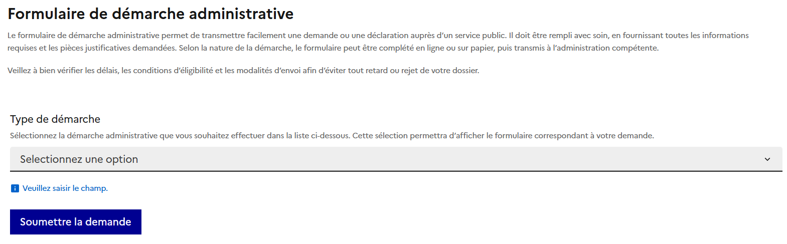
</div>

La sélection du type de formulaire désiré : 

<div align="center">
    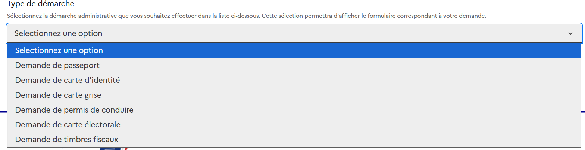
</div>

Le formulaire pour la demande de passeport : 

<div align="center">
    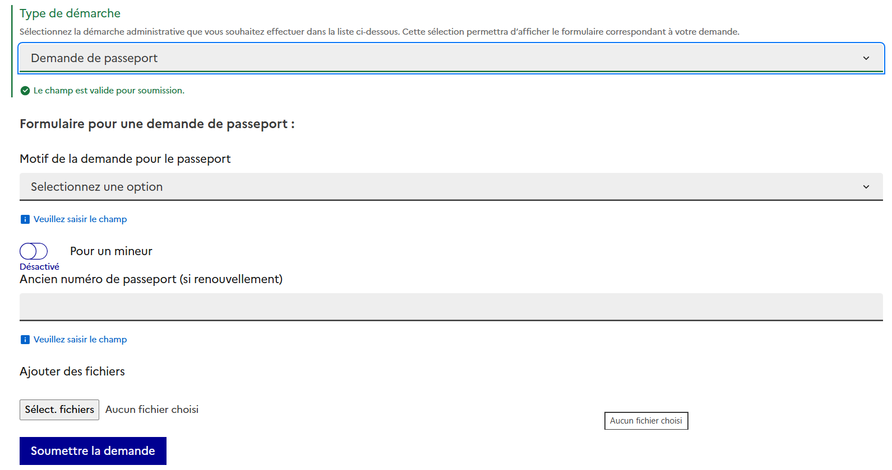
</div>

Le formulaire pour la demande de carte nationale d'identité : 

<div align="center">
    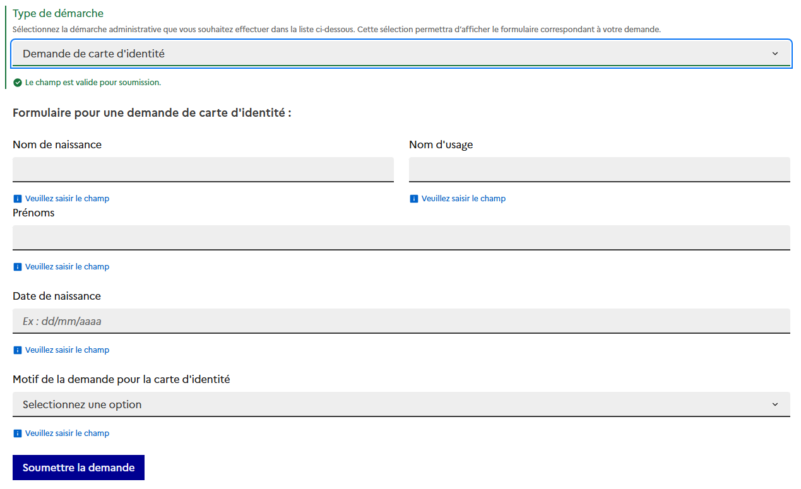
</div>

Un exemple de saisie incorrecte : 

<div align="center">
    
</div>

### 📄 Table

Avec **Pacman**, les tables sont également gérées avec les composants DSFR, ce qui permet d’afficher des listes de données de manière structurée et accessible. Par contre, si les composants DSFR ne prennent pas en charge nativement les tables éditables où certaines cellules peuvent être modifiées directement par l’utilisateur, cette fonctionnalité est néanmoins implémentée et gérée par les générateur **Pacman**. 

Pour le développement et les tests, on utilise *Faker* afin de générer des données fictives réalistes, ce qui permet de peupler les tables sans dépendre d’un backend réel et de vérifier le comportement de l’interface dans différents scénarios.

❗ Au niveau de ce chapitre, on fait délibérément abstraction du binding (liaison des données) avec la couche soa pour se concentrer exclusivement sur la visualisation de l'IHM. Pour la liaison des données, se reporter au chapitre concernant la modélisation des services.

#### Modélisation

La modélisation de la page est la suivante (vue "*Package Diagram*"): 

<div align="center">
    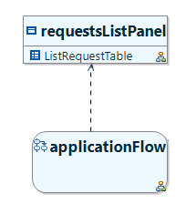
</div>

Ici est présentée la vue du "*mockup*" :

<div align="center">
    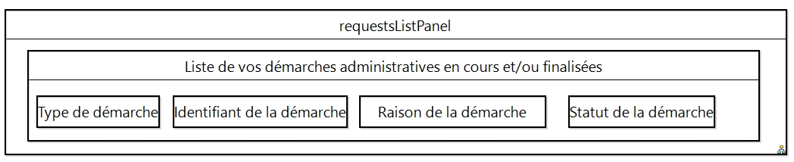
</div>

On peut voir ici la présence d'un conteneur de type "*Table*". Chaque colonne est modélisée à l'aide d'un élément de type "*TableColumn*". Il suffit donc simplement de positionner les différents éléments dont a besoin le développeur afin de modéliser l'ensemble de la table.

Pour le chargement des données, 

❗ Dans le cas d'une table éditable, il faut alors ajouter un second conteneur de type "*TableEditor*" avec un formulaire, et ensuite positionner les différents champs éditables, cette fois, ces champs sont des champs de type Texte, Liste éditable, case à cocher, etc...     

<div align="center">
    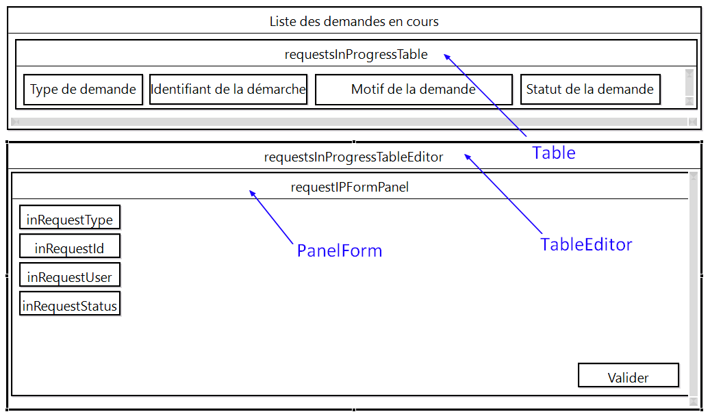
</div>

❗ Il n'est pas obligatoire d'effectuer le raccordement de chaque colonne de la table avec les champs issus d'un service REST. Par défaut à la génération, **Pacman** crée automatiquement un mock avec la librairie DataFaker ce qui permet de tester directement la table avec des données simulées pour tester l'interface sans avoir besoin de modéliser la couche soa.

#### Génération

Voici le code (très simple) pour l'affichage de la table : 

```ts
<Table 
   fixed
   caption="Liste de vos démarches administratives en cours et/ou finalisées"
   data={
     data_ListRequestTable
   }
   headers={[
      "Type de démarche",
      "Identifiant de la démarche",
      "Statut de la démarche",
      "Raison de la démarche",
]}/>
```

Ce code illustre l’utilisation d’une table DSFR pour afficher la liste des démarches administratives de l’utilisateur. La table est configurée avec des colonnes fixes et un titre accessible (caption) pour améliorer l’ergonomie et l’accessibilité. Les données affichées proviennent de "*data_ListRequestTable*", qui peut être peuplé avec des données fictives via Faker pour le développement et les tests. Les en-têtes définissent chaque colonne (Type de démarche, Identifiant, Statut, Raison).

L’état "*data\_ListRequestTable*" contient les données à afficher dans la table. Au chargement du composant (useEffect), les données sont initialement peuplées avec des données fictives générées par "*getFakeTableData\_ListRequestTable()*". La récupération des données fictives est laissée ici pour démonstration dans le cadre de l'écriture de ce document mais (on peut par ailleurs remarquer que cette partie de code est située entre balises de type "*user code*") il suffit de supprimer cette ligne pour évter l'appel au mock.

```ts
const [data_ListRequestTable, setData_ListRequestTable] = useState<any[]>([]);

useEffect(() => {
  // Start of user code 437b0889bfbb91081f33fc51e544c470
  setData_ListRequestTable(getFakeTableData_ListRequestTable());
  // End of user code
  
  // Start of user code 30f1bf4c7f24fc1157c498bc73b9edce
  // Placer ici le code pour l'initialisation des paramètres en entrée.
  const userId = user?.id;
  // End of user code
    
  getUserRequests(userId)
    .then(rows => {
      setData_ListRequestTable(
      listRequestTableDataMap(rows));}); 
}, []);
```
Pour information le code du mock généré par défaut est situé au niveau de la page "**/src/mocks/[nom de la page]Mock.tsx**". Dans le cas de la table qui vient d'être générée, ce code est le suivant : 

```ts
import { fakerFR } from '@faker-js/faker';

// Start of user code d1177b453a3736dc602f6dc49b423f6b
// End of user code

export function getFakeTableData_ListRequestTable(nbRows = 10): string[]{
 // Start of user code 73e2c0c91f656f72845d18274c53bd12
 return Array.from({ length: nbRows }, () => [
   fakerFR.string.alphanumeric(15),
   fakerFR.string.alphanumeric(15),
   fakerFR.string.alphanumeric(15),
   fakerFR.string.alphanumeric(15),
  ] );
  
 // End of user code
}
```
Ce code définit donc une fonction utilitaire pour générer des données fictives destinées à peupler la table des demandes ("*ListRequestTable*") pendant le développement.

La fonction "*getFakeTableData_ListRequestTable*" prend en paramètre "*nbRows*" (nombre de lignes à générer, par défaut 10) et retourne un tableau de tableaux, où chaque sous-tableau représente une ligne de la table avec quatre champs alphanumériques générés aléatoirement grâce à "*fakerFR.string.alphanumeric(15)*".

L’objectif est de fournir des données mockées rapidement pour tester l’affichage et le fonctionnement de la table sans dépendre d’un backend réel. Le développeur peut ensuite remplacer ou compléter cette génération avec des données plus réalistes, correspondant aux types, statuts et motifs des demandes réelles, afin de mieux simuler le comportement de l’application avant la connexion aux services réels (consulter pour cela les possibilités de Faker).


La fonction "*listRequestTableDataMap*" effectue le mapping des données brutes pour la table DSFR : elle transforme chaque objet req en tableau correspondant aux colonnes, et remplace les codes (type, status, reason) par des libellés lisibles à l’aide des constantes REQUEST_TYPE_LABELS, REQUEST_STATUS_LABELS et REQUEST_REASON_LABELS. Cela permet d’afficher directement des intitulés compréhensibles dans la table plutôt que des codes techniques. 

Il est ici impossible de tout laisser à la génération automatique, le développeur doit donc surcharger le résultat de la génération (dans les zones "*user code*" prévues à cet effet) pour que l’ensemble fonctionne correctement. Il est à noter que ce code supplémentaire est uniquement lié au fait de l'utilisation de la valeure de listes déroulantes au niveau de la table. Si au niveau de cette dernière il n'y avait que des champs finaux à afficher la génération automatique prends le relais..

```ts
function listRequestTableDataMap (result) {
  return result
     // Start of user code 8418c7d927433a3f80bc88ca2bd3797f
     // End of user code
     .map(req => { 
     const row = [
     req.type ?? "",
     req.identifier ?? "",
     req.status ?? "",
     req.reason ?? "",
     ];
     // Start of user code 88028396c07b2e788f2c5e6e616c02d7
     row[0] = REQUEST_TYPE_LABELS[req.type] ?? row[0];
     row[2] = REQUEST_STATUS_LABELS[req.status] ?? row[2];
     row[3] = REQUEST_REASON_LABELS[req.reason] ?? row[3];
     // End of user code
     return row;
  });
}
```

Ici, afin de récupérer le libellé pour l'afficher dans la colonne (et non directement la valeur récupérée par le service avec "*req.type*, *req.status* et *req.reason*") le développeur doit donc surcharger l'injection dans le tableau représentant la ligne.

```ts
// Start of user code 8f15ff7826ad45e166f2985365071af5
  
const REQUEST_TYPE_LABELS: Record<string, string> = {
  PA: "Demande de passeport",
  CN: "Demande de carte d'identité",
  CG: "Demande de carte grise",
  PC: "Demande de permis de conduire",
  CE: "Demande de carte électorale",
  TF: "Demande de timbres fiscaux",
};
  
const REQUEST_REASON_LABELS: Record<string, string> = {
  PD: "Première demande",
  RE: "Renouvellement",
  CA: "Changement d'adresse",
  PE: "Perte",
  VO: "Vol",
};
  
const REQUEST_STATUS_LABELS: Record<string, string> = {
  DE: "Déposée",
  ET: "En cours",
  AC: "Acceptée",
  TE: "Traitée",
  RE: "Rejetée",
  AN: "Annulée",
};
// End of user code
```

Ici pour raisons pratiques, des tables de conversion ont été écrites "en dur" mais il serait tout à fait possible de récupérer ces libellés en faisant appel à des services REST issus d'un référentiel... le développeur est en effet, libre d'écrire n'importe quel type de code à l'intérieur des zones de type "*user code*".

Le résultat à l'affichage est le suivant : 

<div align="center">
    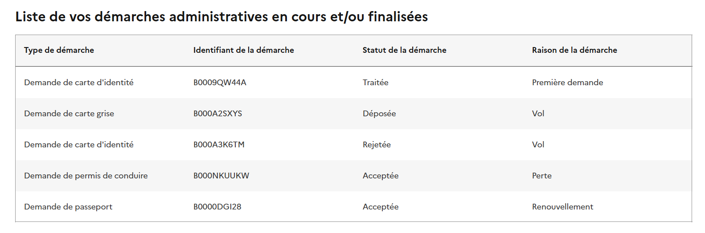
</div>

Dans le cas d'un table éditable (comme modélisée précédemment), le code généré est le suivant : 

### 📄 Page standard

Bien que la modélisation d’un formulaire et celle d’une table couvrent l’essentiel des cas d’usage (en termes de données dynamiques), il reste pertinent d’aborder également la modélisation d’une page plus simple, dédiée uniquement à l’affichage de quelques données. Pour cet exemple nous prendrons la page d'affichage des informations pour le profil utilisateur. Comme il est possible de le voir avec l'écran ci-dessous, il s'agit simplement d'afficher quelques informations essentielles pour l'identification de l'utilisateur connecté.

<div align="center">
  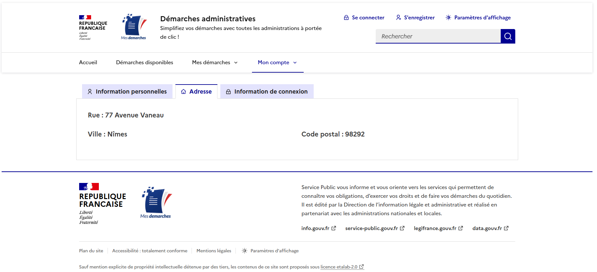
</div>

#### Modélisation

Ici le "*mockup*" modélisé comprend des onglets (*Tab*) et des simples composants "*Text*" : 

<div align="center">
  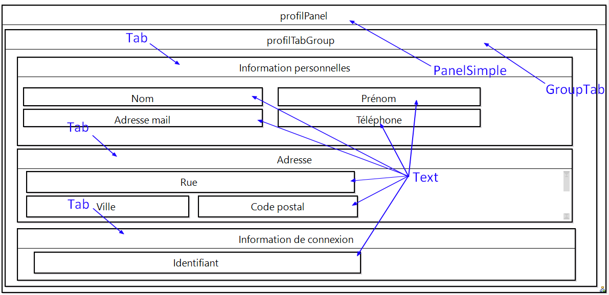
</div>

Chaque composant "*Tab*" (Informations personnelles, Adresse et Informations de connexion) est lié ("*binding*") avec le DTO "*userDemo*" : 

<div align="center">
  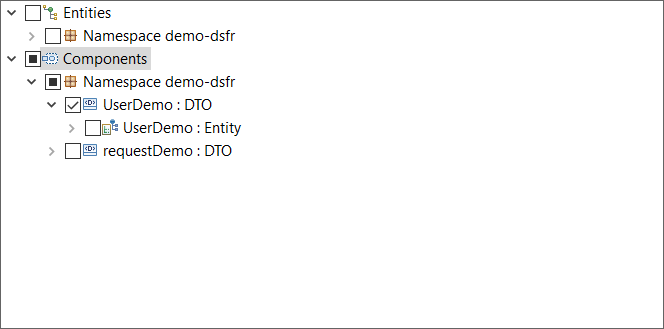
</div>

Enfin chaque champ "Text" est lié à un attribut du DTO "*userDemo*" (ici le nom) : 

<div align="center">
  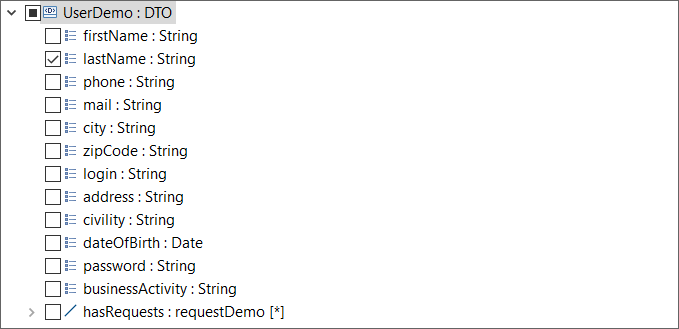
</div>

Ici aussi, on désire avoir les données au moment du chargement de la page. Cependant l'ensemble des données pour l'utilisateur ayant déjà été chargées lorsque ce dernier s'est authentifié et ces dernières étant conservées au niveau du "*SessionStorage*", il n'y a donc pas besoin de modéliser une action avec une transition associée à un événement de type "*onLoad*".

#### Génération

Ici, le code de la page générée est beaucoup plus simple : 

```ts
import React from "react";
import { useEffect, useState } from "react";
import { useNavigate, useLocation } from "react-router-dom";
import { useAuth } from "../contexts/AuthContext";
import { Tabs } from "@codegouvfr/react-dsfr/Tabs";

// Start of user code 390f51c79e9352b2247aa06eb0ba83c1
// End of user code

export default function ProfilPanel () {
  
  // --------------------------------
  // Gestion générique de la sécurité.
  // --------------------------------
  const { login, user, logout } = useAuth();
  
  // Start of user code 3bc24b8d7f42ddf1b8e1410a27e4cead
  // End of user code
  
  return (
    <>
      <Tabs
        onTabChange={function noRefCheck(){}}
        tabs={[
      { 
        isDefault: false,
        iconId: "fr-icon-user-line",
        label: "Information personnelles",
        content: (<>
      <div className="fr-grid-row fr-grid-row--gutters fr-grid-row--top">
      <div className="fr-col">
      <p className="fr-text--lg fr-text--bold">Nom : {" "}
      {user?.lastName ?? "-"}</p>
      </div>
      <div className="fr-col">
      <p className="fr-text--lg fr-text--bold">Prénom : {" "}
      {user?.firstName ?? "-"}</p>
      </div></div>
      <div className="fr-grid-row fr-grid-row--gutters fr-grid-row--top">
      <div className="fr-col">
      <p className="fr-text--lg fr-text--bold">Adresse mail : {" "}
      {user?.mail ?? "-"}</p>
      </div>
      <div className="fr-col">
      <p className="fr-text--lg fr-text--bold">Téléphone : {" "}
      {user?.phone ?? "-"}</p>
      </div></div>
      </>)},
      { 
        isDefault: false,
        iconId: "fr-icon-home-4-line",
        label: "Adresse",
        content: (<>
      <p className="fr-text--lg fr-text--bold">Rue  : {" "}
      {user?.address ?? "-"}</p>
      <div className="fr-grid-row fr-grid-row--gutters fr-grid-row--top">
      <div className="fr-col">
      <p className="fr-text--lg fr-text--bold">Ville  : {" "}
      {user?.city ?? "-"}</p>
      </div>
      <div className="fr-col">
      <p className="fr-text--lg fr-text--bold">Code postal : {" "}
      {user?.zipCode ?? "-"}</p>
      </div></div>
      </>)},
      { 
        isDefault: false,
        iconId: "fr-icon-lock-line",
        label: "Information de connexion",
        content: (<>
      <p className="fr-text--lg fr-text--bold">Identifiant  : {" "}
      {user?.login ?? "-"}</p>
      </>)},
      ]}/>
    </>
  );
}
```
On commence par récupérer l’utilisateur courant via le hook "*useAuth*", ce qui permet d’accéder aux données de profil tout en restant cohérent avec la gestion centralisée de l’authentification.

Le contenu de chaque onglet affiche simplement les données issues de l’objet "*user*", avec l’opérateur "*?.*" pour éviter les erreurs si certaines propriétés sont absentes, et une valeur par défaut ("-") lorsque l’information n’est pas disponible.

Ce composant illustre ainsi une page purement déclarative, orientée affichage, où la logique métier est minimale et où l’essentiel du comportement et du rendu est délégué aux composants DSFR.

### 🔒 Authentification 

#### Modélisation

#### Génération

### 🔗 Service

Les services REST destinés à être appelés par l'application React sont modélisés et générés par l'ensemble des générateurs **Pacman** backend. Il est en effet nécessaire de modéliser et générer : 

- la partie "fournisseur de service" en SpringBoot, destinée à fonctionner sur un serveur Tomcat.

- la partie "client" en React, qui sera compilée sous forme de librairie et importée au niveau du projet frontend.

Se reporter à la documentation ad hoc pour créer la librairie d'appel et l'ensemble des services.

#### Importation d'une librairie

Une fois la librairie créée (sous forme de fichier "*.tgz*"), récupérer le fichier et le copier au niveau du répertoire "*/lib*" dans le projet serveur (**[Nom de l'application]-server**). 

Se positionner en ligne de commande au niveau du répertoire "*/lib*" du projet serveur et installer la librairie à l'aide de la commande suivante : 

```shell
npm install [Nom de la librairie].tgz
```

Le résultat de la commande devrait retourner (le résultat exact dépend évidemment de la librairie à installer, par ailleurs, ne pas tenir compte des vulnérabilités) : 

```shell
up to date, audited 227 packages in 3s

55 packages are looking for funding
  run `npm fund` for details

2 moderate severity vulnerabilities

To address all issues, run:
  npm audit fix

Run `npm audit` for details.
```

Pour vérifier la bonne prise en compte de la librairie, se positionner au niveau du répertoire "*/node_modules*" et regarder si il existe bien un nouveau répertoire avec comme nom celui de la librairie qui vient d'être installée. Dans le cas de notre application de démonstration, la librairie a été appelée : "*demo-dsfr-client-rest*".

<div align="center">
  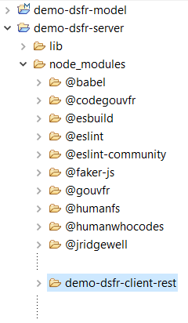
</div>

Enfin, il est aussi possible de vérifier sa bonne prise en compte au niveau du fichier de configuration "*package.json*" : 

```ts
  "dependencies": {
    "@codegouvfr/react-dsfr": "^1.26.0",
    "@gouvfr/dsfr": "^1.14.1",
    "demo-dsfr-client-rest": "file:lib/demo-dsfr-client-rest-1.0.0.tgz",
    "react": "^19.1.1",
    "react-dom": "^19.1.1",
    "react-hook-form": "^7.45.0"
  },
}
```

Une fois la librairie client installée, il est nécessaire d'importer la modélisation soa qui a permis de générer à la fois la partie fourniture et la partie client. Pour la création de l'export, se reporter à la documentation du backend.

Pour la partie import : 

- se positionner au niveau du projet de modélisation **[Nom de l'application]-model** et par clic droit, séléctionner sous la rubrique "*IS Designer*" le menu "*Import library into modeling project*".

- A l'aide du bouton "*Browse*", rechercher le fichier au format "*.mar*" et importer la librairie.

Les différents fichiers de modélisation sont alors automatiquement copiés dans le répertoire "*/libraries*" du projet de modélisation pour l'application et sont maintenant disponibles pour pouvoir relier la couche cinématique avec la couche soa.

<div align="center">
  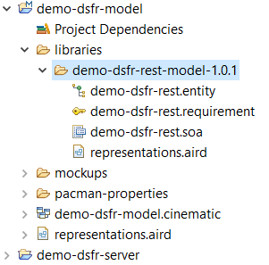
</div>

#### Modélisation

Pour relier un service avec une page,  nous allons reprendre les deux pages précédentes qui ont été étudiées pour la modélisation d'un formulaire et la modélisation d'une table. Dans le cas de la table, nous désirons que les données soit affichées directement au chargement de la page. 

Il est donc nécessaire de modéliser une action au niveau du diagramme des "*Flow*" et de relier cette action avec une transition (la transition de retour n'est pas utilisée au niveau de la modélisation mais il est fortement conseillé de la positionner afin de mieux comprendre les intéractions entre les différents composants) :

<div align="center">
  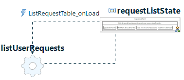
</div>

Se positionner au niveau de la transition afin de faire apparaître ses propriétés et à l'aide du bouton "*+*", relier la transition avec un événement. Dans le cas présent comme nous désirons que l'action s'effectue au chargement de la page nous allons choisir un événement de type "*onLoad*".

<div align="center">
  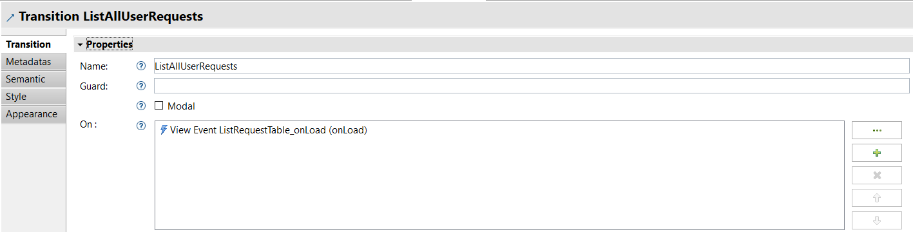
</div>

❗ Attention lors du choix de l'évenement à bien prendre celui qui est directement issu de l'élément à impacter, et non pas celui de son éventuel conteneur. Dans notre cas, il s'agit donc de l'événement "*onLoad*" attaché à la table et non à la page ou au formulaire, etc... Au niveau de la rubrique "*On*", cliquer sur le bouton "*+*" comme cité précédemment et cocher l'événement dans la nouvelle fenêtre qui apparaît : 

<div align="center">
  
</div>

Se positionner ensuite au niveau de l'action qui vient d'être modélisée et pareillement accéder à ses propriétés afin de sélectionner l'opération à effectuer. Dans notre cas, il s'agit du service de récupération de démarches administratives pour un utilisateur. A l'aide du bouton "*+*" de la rubrique "*Actions*", ouvrir la nouvelle fenêtre ...

<div align="center">
  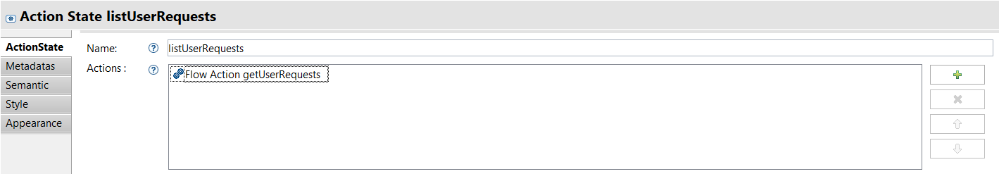
</div>

... et pareillement, utiliser le bouton "*+*" de la rubrique "*Operations*" ... 

<div align="center">
  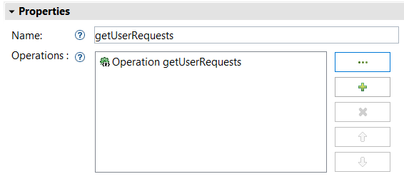
</div>

... afin de sélectionner le service désiré (ici, le service "*getUserRequests*"): 

<div align="center">
  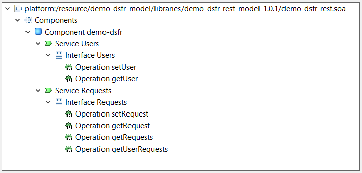
</div>

❗ Attention, lors de la récupération de l'action, il n'est pas possible pour le générateur de connaitre la librairie utilisée (celle d'ou provient l'opération sélectionnée) car cette information n'est pas présente dans le méta-modèle. Il est donc nécessaire d'indiquer pour chaque "*Action*" à quelle librairie elle appartient en positionnant une métadonnées : "*LIBARY_NAME*" avec le nom complet de la librairie : 

<div align="center">
  
</div>

Dans le cas du formulaire pour l'enregistrement d'une nouvelle demande administrative, répéter les différentes étapes vues ci-dessus, cette fois c'est l'opération "*setRequest*" qui doit être sélectionnée et au niveau de la transition, c'est l'événement "*onSumit*" du bouton de validation pour le formulaire.  

<div align="center">
  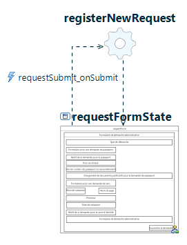
</div>

Une dernière phase (pourtant essentielle) est nécessaire pour attacher les différents composants ("*widgets*") avec les données issues de la couche soa. Pour ce faire, se positionner au niveau du "*mockup*" et au niveau de chaque composant effectuer un clic droit afin de faire apparaitre le menu contextuel pour la liaison de données. 

<div align="center">
  
</div>

Ainsi pour la modélisation de la table : 

<div align="center">
  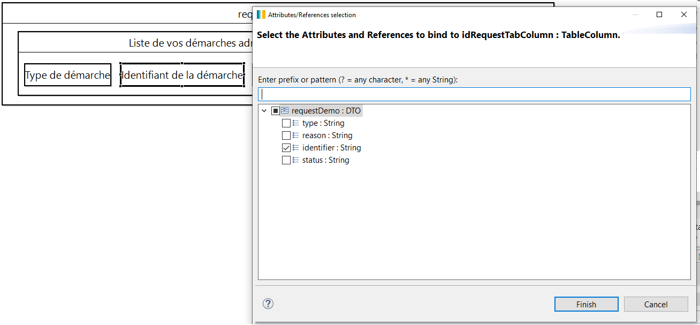
</div>

❗ Bien penser que si des composants sont dans un conteneur, il peut être nécessaire de lier préalablement le conteneur avec le DTO. Toujours dans le cas de la modélisation pour la table, le composant "*Table*" à par exemple été lié avec le DTO "*requestDemo*".

<div align="center">
  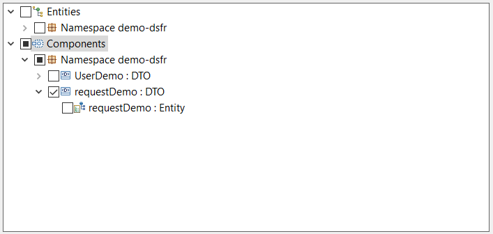
</div>

#### Génération

Au niveau des imports, on peux constater qu'un nouvel import est effectué automatiquement pour mettre à disposition la nouvelle librairie importée. On remarque qu'il y a deux imports pour un service, l'import pour le service en lui-même auquel il faut ajouter l'import pour les objets du service (DTOs).

```ts
import { requests } from "demo-dsfr-client-rest";
import { RequestDemo } from "demo-dsfr-client-rest";
```

En reprenant le code des différentes pages, il est maintenant possible de s'attarder sur les appels de service qui ont été générés.

Pour l'affichage de la table : 

```ts
useEffect(() => {
  // Start of user code 437b0889bfbb91081f33fc51e544c470
  // End of user code
    
  // Start of user code 30f1bf4c7f24fc1157c498bc73b9edce
  // Placer ici le code pour l'initialisation des paramètres en entrée.
  const userId = user?.id;
  // End of user code
    
  getUserRequests(userId)
    .then(rows => {
      setData_ListRequestTable(
      listRequestTableDataMap(rows));}); 
}, []);
```

Ici, on remarque la présence de zone "*user code*" dans laquelle il est nécessaire pour le développeur de déclarer un variable et d'assigner à cette dernière la donnée à envoyer au service. Ceci est une limitation des générateurs **Pacman** avec la génération pour React. Pour l'instant aucune solution d'automatisation n'a encore été trouvée à ce jour. L'appel du service s'effectue avec "*getUserRequests(userId)*".

Pour l'enregistrement du formulaire (appel de "*setRequest(payload)*") : 

```ts
const onSubmit = async (data: FormValues) => {
  try {
     console.log("Formulaire soumis :", data);
     ...
     const payload = buildRequestFormPayload(data);
     await setRequest(payload);
     ...
     setGlobalMessage({ 
        text: "La demande a bien été envoyé.", 
        severity: "success",
     });
     navigate("/");
    } catch (error) {
      ...
    }
};
```
Pour rappel, ici le terme "*payload*" désigne ici une structure générique qui regroupe l’ensemble des données issues du formulaire, qu’elles soient utilisées telles quelles ou enrichies et transformées via la fonction "*buildRequestFormPayload*".

La gestion des erreurs d’appel aux services repose ici principalement sur l’utilisation de blocs "*try / catch*" autour des opérations asynchrones. Lors de la soumission du formulaire, les appels métier (validation, construction du payload, appel du service REST) sont exécutés dans un contexte sécurisé : si une erreur survient (exception levée, promesse rejetée, problème réseau, etc.), elle est interceptée dans le catch. Cela permet d’éviter un crash de l’application et de fournir un retour utilisateur via un message global d’erreur.

❗ La présence de "*await*" dans la fonction "*onSubmit*" et son absence dans le "*useEffect*" s’explique par le contexte d’exécution et les contraintes propres à React. Dans le cas de onSubmit, il s’agit d’une action utilisateur déclenchée explicitement, où le traitement doit être strictement séquentiel : on valide les données, on appelle le service distant, puis on enchaîne sur l’affichage d’un message et la navigation. L’utilisation de "*async / await*" permet ici d’attendre chaque étape, de garantir l’ordre d’exécution et de centraliser la gestion des erreurs via un "*try/catch*". À l’inverse, la fonction passée à "*useEffect*" ne peut pas être déclarée "*async*", car React attend soit une fonction synchrone, soit une fonction de nettoyage. L’appel asynchrone est donc géré via une promesse avec "*.then()*", ce qui respecte l’API de React.

❗ Lors de la génération, toute page a automatiquement une page de service associée qui est générée au niveau du répertoire "*/src/services*" avec pour nom de fichier : "**[Nom de la page]Services.ts**", il est alors possible pour le développeur d'écrire ses propres appels sans passer obligatoirement par une librairie.

#### Sécurisation

La sécurisation des services REST repose principalement sur l’utilisation de mécanismes d’authentification et d’autorisation adaptés aux échanges HTTP. Ave cled générateurs **Pacman** la gestion des appels sécurisés consiste à utiliser des jetons ("*tokens*"), de type JWT (cas le plus courant de manière générale), émis après une authentification réussie et transmis ensuite à chaque appel de service via l’en-tête Authorization.

Ce processus est transparent dans le cadre de la génération de la cinématique, il existe juste un paramètre supplémentaire pour le passage du jeton. Pour la sécurisation des services (et appels) rest, se reporter à la documentation concernant **Pacman**" backend. 

### Tests

Pour les tests, il suffit simplement (comme vu précédemment au niveau du chapitre concernant le lancement du serveur) de lancer la commande suivante dans le terminal :

```shell
npm run dev
```
Il est même fortement conseillé de laisser le serveur toujours tourner pendant le temps de développement puisque toute la génération est automatiquement et instantanément reprise "à chaud".

## ✔️ Validation de la modélisation
---
On peut remarquer la présence d'une "***Validation du diagramme de modélisation***". Quelle que soit la couche à générer, il est toujours possible de lancer directement le générateur désiré et celui-ci va automatiquement activer la validation du diagramme avant de se lancer. Si des erreurs sont detectées, il est alors possible d'aller voir le résultat de la validation au niveau de la vue dédiée à la validation (Rapport de validation).

Pour plus d'informations sur le fonctionnement et l'utilisation du système de validation, se reporter à la documentation de **Pacman** backend.

## Déploiement

[A traiter]

## 📎 Annexes
---
• Liste des métadonnées disponibles

| Métadonnée  | Corps       | Description|
|-------------|-------------|------------|
| TXT_PLACEHOLDER | OUI | Texte indicatif tant que l’utilisateur n’a rien saisi |
| TXT_INFO | OUI | Texte affiché tant que l’utilisateur n’a rien saisi|
| TXT_ERROR | OUI | Texte affiché sur erreur |
| TXT_VALID | OUI | Texte affiché sur validation |
| WITH_PATTERN | OUI | Regex pour vérification champ |
| WITH_ICON | OUI | Ajout icône pour certains composants DSFR |
| WITH_MAXLENGTH | OUI | Taille maximale pour le champ |
| WITH_BUTTON_ADDON | OUI | Ajout bouton pour certains composants DSFR |
| WITH_BUTTON_ACTION | OUI | Ajout bouton pour certains composants DSFR |
| WITH_HINT | OUI | Texte à ajouter pour le champ |
| WITH_VALUE | OUI | Valeur à associer pour une case à cocher |
| WITH_VALUE_MAX | OUI | Valeur max pour composant DSFR (Range) |
| WITH_VALUE_MIN | OUI | Valeur min pour composant DSFR (Range)|
| WITH_HIDE_MIN_MAX | OUI | Affiche ou non les valeurs min et max (Range)|
| WITH_VALUES | OUI | Liste des valeurs pour une liste déroulante | 
| WITH_DOUBLE | OUI | Spécifique composant DSFR (Range) |
| WITH_STEPS | OUI | Valeur d'incrément pour composant DSFR (Range)| 
| WITH_PREFIX | OUI | Préfixe pour valeur du composant DSFR (Range)|
| WITH_SUFFIX | OUI | Suffixe pour valeur du composant DSFR (Range)| 
| WITH_IMG | OUI | Ajout d'une image au composant DSFR| 
| WITH_REQUIRED | OUI | Champ obligatoire pour les cases à cocher | 
| WITH_LINK | OUI | Ajout d'un lien au composant DSFR|
| WITH_ORIENTATION | OUI | Ajout d'une orientation pour composant DSFR (Logo) | 
| WITH_MSG_GROUP | OUI | Ajout de texte pour un composant DSFR (Password)  | 
| WITH_URL | OUI | Ajout d'une URL pour un panneau | 
| WITH_BRAND_TOP | OUI | Ajout de texte pour un composant DSFR (PanelHeader) | 
| WITH_CLOSABLE | OUI | Permet ou non de fermer le composant DSFR (Notice)| 
| WITH_SEVERITY | OUI | Positionne l'état pour un composant DSFR (Notice) | 
| WITH_DEFAULT_EXPANDED | OUI | Force l'ouverture pour un composant DSFR (GroupAccordion) |
| WITH_DEFAULT_OPENED | OUI | Force l'affichage pour un composant DSFR (Tab) | 
| WITH_DISPLAY | OUI | Affichage pour accessibilité composant DSFR (Header/Footer) | 
| WITH_COLOR_VARIANT | OUI | Couleur pour les lignes du composant DSFR (Table) | 
| WITH_EDITION | OUI | Possibilité d'édition pour le composant DSFR (Table) | 
| WITH_SIZE | OUI | Taille pour le composant DSFR (Button) | 
| WITH_FONT_SIZE | OUI | Taille pour la fonte composant DSFR (Tile) | 
| WITH_ARROW_TYPE | OUI | Type de flêche pour composant DSFR (Link) | 
| WITH_CUSTOM_CODE | OUI | Code spécifique utilisateur sur composant DSFR | 
| WITH_FORCE_SECURED | OUI |  | 
| WITH_DISABLED | OUI | Désactivation du composant DSFR | 
| WITH_LIBRARY_NAME | OUI | Nom de la librarie SOA pour l'action | 
| WITH_TOOLTIP | OUI | Ajout tooltip pour le composant DSFR | 

• Liste des règles de validation

| Règle| S'applique sur |
|------|----------------|
|Un contrôleur ne peux gérer qu'une seule page|VIEWSTATE|
|Une page ne peux avoir qu'un seul contrôleur|VIEWCONTAINER|
|Une page doit avoir au moins un composant|VIEWCONTAINER|
|Un composant "*Tab*" doit être dans un conteneur "*GroupTab*"||
|Un composant "*Accordion*" doit être dans un conteneur "*GroupAccordion*"||
|Un composant "*CheckBox*" doit être dans un conteneur"*GroupCheckBox*"||
|Un composant "*NavigationElement*" doit être dans un conteneur "*GroupNavigation*"||
|Un composant "*Radio*" doit être dans un conteneur "*GroupRadio*"||
|Un composant "*TableColumn*" doit être dans un conteneur "*Table*"||
|Un composant "*ButtonSubmit*" doit être dans un conteneur "*PanelForm*"||